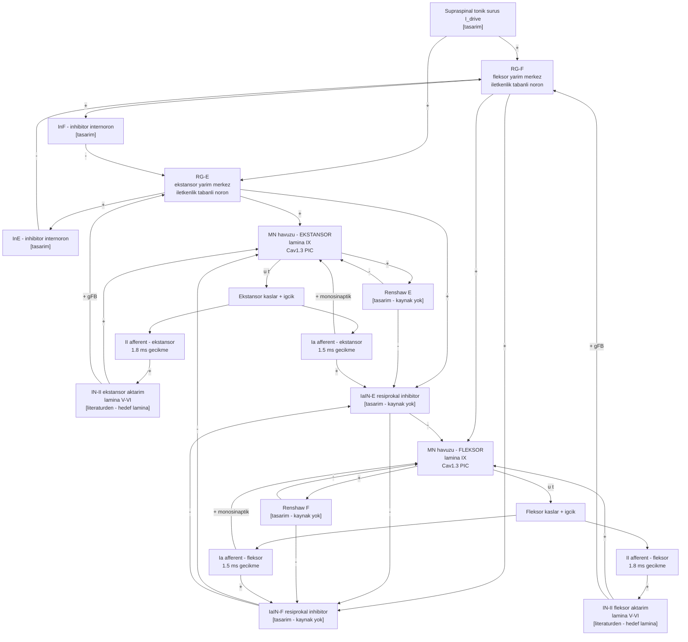

# D2 — Omurilik devresi (hücre düzeyi)

Devrenin **temel motifi** bir antagonist çift içindir (fleksör ⇄ ekstansör). Aynı motif üç eklem
için (kalça, diz, ayak bileği) tekrarlanır; hangi kasın hangi tarafa düştüğü `D6`'dadır.

Oklar: `+` eksitatör, `−` inhibitör.

## Katman katman: ne, nereden, hangi durumda

| Katman | Ne yapar | Kaynak | Durum |
|---|---|---|---|
| Supraspinal sürüş | Ritmi başlatan sabit sürüş; MLR benzeri | — | `[tasarım]` |
| CPG yarım-merkezleri (RG-F, RG-E) | Karşılıklı inhibisyonla ritim üretir | `oz_yu2021_kapalidongu.md` §3a-3b — Morris-Lecar HCO, karşılıklı inhibitör sinapslar | `[literatürden]` mimari; hücre modeli `[tasarım]` |
| Geri besleme iletkenliği `gFB` ve CPG içi `gCPG` | Ritmin ne kadarının merkezden, ne kadarının duyudan geldiğini belirler | `oz_yu2021_kapalidongu.md` §4b — gFB↑ dış pertürbasyona gürbüz, iç gürültüye hassas | `[literatürden]` ödünleşim; değerler taranacak |
| Ia monosinaptik eksitasyon (afferent → homonim MN) | Germe refleksinin doğrudan kolu | `oz_vincent2017_proprioseptor.md` §4b — Ia varikoziteleri lamina IX'ta triceps surae motor havuzunun ≥30 µm nöronlarıyla temas | `[literatürden]` anatomik kanıt |
| II afferentin lamina V/VI'ya yönelmesi | II bilgisi motonörona **aktarım internöronu üzerinden** gider | `oz_vincent2017_proprioseptor.md` §4b — iğcik afferentleri LV/VI + LIX'te >%80; II, LV/VI'ya yanlı | `[literatürden]` |
| Ia inhibitör internöron (resiprokal inhibisyon) | Antagonist havuzu susturur | özüt setinde **kaynak yok** | `[tasarım]` — kaynak eklenecek veya devre dışı bırakılacak |
| Renshaw hücresi (rekürren inhibisyon) | Havuzun kendi çıkışını sınırlar | özüt setinde **kaynak yok** | `[tasarım]` — aynı uyarı |
| Motonöron havuzu | Kim 2020 biyofiziksel motonöronu; ayrıntısı `D3` | `oz_kim2020_piclokasyonu.md` | `[literatürden]` hücre |

## Dürüstlük notu

`IaIN` ve `Renshaw` katmanları **bu projenin literatür setinde kaynağı olmayan** iki kutudur.
Devrenin çalışması için gerekli görünüyorlar ama şu an bir yayına dayanmıyorlar. İki seçenek:

1. Bunları destekleyen bir kaynak `07_literatur/`'e eklenir ve özütlenir; ya da
2. İlk sürümde devre dışı bırakılır — CPG'nin karşılıklı inhibisyonu zaten fleksör/ekstansör
   almaşmasını üretir (`oz_yu2021_kapalidongu.md`: HCO tek başına osilasyon veriyor).

Karar verilene kadar bu iki kutu **iddia edilmez**.

## Neden yarım-merkez seçildi

`oz_yu2021_kapalidongu.md` §4b: salt ileri beslemeli (gFB = 0) sistem yalnız simetrik çevrim
üretir; geri besleme eklenince asimetrik çevrimler ve "zincir refleks" ritmi gibi yeni davranışlar
doğar. Yani **kapalı döngüyü kurmadan CPG'yi anlamak mümkün değil** — bu, bildiri özetinin
"lokomosyon kapalı döngüdür" cümlesinin dinamik sistem karşılığıdır.

Aynı özütün uyarısı da devrededir: `gFB` büyüdükçe duyusal gürültüye hassasiyet artar. `gFB/gCPG`
taraması yapılırken bu ödünleşim raporlanacaktır.
