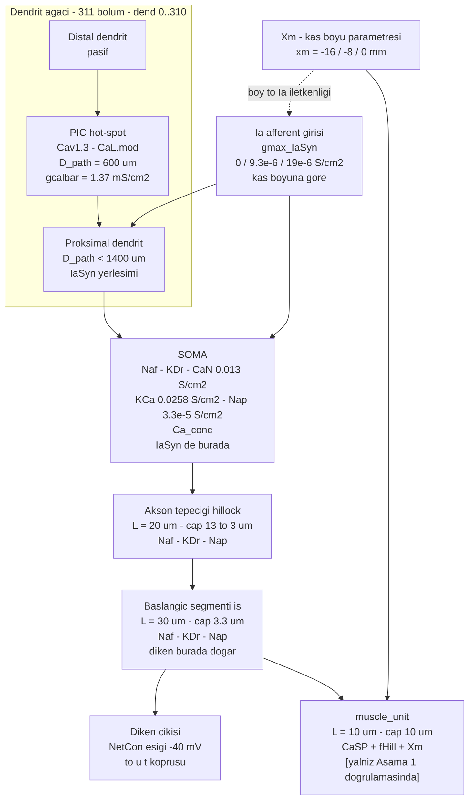

# D3 — Tek motonöron: bölmeler, kanallar, PIC ve Ia sinapsı

Havuzun yapı taşı, Kim 2020'nin NEURON motonöronudur. Depodaki uygulama:
`inline-supplementary-material-1/fig2_4_6/`.

## Bölme ve kanal dökümü

| Bölme | Geometri | Mekanizmalar | Kaynak | Durum |
|---|---|---|---|---|
| Soma | vemoto6 morfolojisi, Cullheim 1987 hücre 43/5'e göre düzeltilmiş | Naf, KDr, CaN (`gcanbar` 0,013 S/cm²), KCa (`gkcabar` 0,0258 S/cm²), Nap (3,3·10⁻⁵ S/cm²), Ca_conc | `oz_kim2020_piclokasyonu.md` §3a; `mem_mechanism_acti.hoc` | `[literatürden]` |
| Akson tepeciği | L = 20 µm, çap 13 → 3 µm, `nseg` = 10 | Naf, KDr, Nap | `add_hil_is.hoc`; Kellerth 1979 | `[literatürden]` |
| Başlangıç segmenti | L = 30 µm, çap 3,3 µm | Naf, KDr, Nap | `add_hil_is.hoc` | `[literatürden]` |
| Dendritler | 311 bölüm (`dend[0..310]`) | pasif + PIC hot-spot | `group_Ia.hoc`, `add_pics_istim.hoc` | `[literatürden]` |
| PIC hot-spot | somadan yol uzaklığı `D_path` = 600 µm | Cav1.3 (`CaL.mod`), `gcalbar` = 1,37 mS/cm² | `add_pics_istim.hoc` satır 57; Kim Tablo 1 | `[literatürden]` |
| Ia sinaps bölgesi | soma + `D_path` < 1400 µm olan tüm dendritler | `IaSyn`, `gmax` = 9,3·10⁻⁶ S/cm² (optimal boy) | `group_Ia.hoc` | `[literatürden]` |
| `muscle_unit` | L = 10 µm, çap 10 µm, `is(0)`'a bağlı | `CaSP` (sarkoplazmik Ca), `fHill` (Hill kuvveti), `Xm` | `add_muscle_unit.hoc`, `mem_mechanism_muscle.hoc` | `[literatürden]` — **kapalı döngüde devre dışı** |

## PIC konumu neden bir parametre, sabit değil

`oz_kim2020_piclokasyonu.md` Tablo 1: `D_path` 100 µm'den 1000 µm'ye kaydırıldığında,
somaya ulaşan etkin Ca akımı 22 nA'da sabit tutulmak için `gcalbar` şöyle değişir:

| `D_path` (µm) | 100 | 200 | 300 | 400 | 500 | 600 | 700 | 800 | 900 | 1000 |
|---|---|---|---|---|---|---|---|---|---|---|
| `gcalbar` (mS/cm²) | 1,57 | 1,14 | 1,21 | 1,25 | 1,28 | **1,37** | 1,39 | 1,95 | 2,80 | 4,10 |

Bu, motonöronun girdi-çıktı karakterini belirler: proksimal yerleşim doğrusal (Tip I), ara
yerleşim histerezisli (Tip IV), distal yerleşim genişlemiş kendini-sürdürme (Tip III) davranışı
verir (Kim §4b, Bennett 2001 sınıflaması).

**Bizim için uyarı** (`oz_kim2020_piclokasyonu.md` §6.1): bu sayılar **kedi** motonöronundan
gelir; yazar, küçük dendritli ve yüksek uyarılabilirlikli türlerde (sıçan bu sınıfa girer)
PIC-konum etkisinin "considerably low" olabileceğini kendisi yazar. Sıçan modelinde etkiler
zayıf çıkarsa bu bir hata değil, beklenen sonuçtur.

## Kas boyu bağlantısı: `Xm`

`Xm` mekanizması `muscle_unit`'e yerleştirilmiş bir **parametredir** (`Xm.hoc`). Kim'in modelinde
üç ayrık boy kullanılır: `xm` = −16 mm (fizyolojik minimum), −8 mm (optimal), 0 mm (maksimum);
bu boya göre `gmax_IaSyn` sırasıyla 0, 9,3·10⁻⁶ ve 19·10⁻⁶ S/cm² alınır.

Bizim kapalı döngümüzde `xm` **ayrık üç değer değil**, OpenSim'den gelen sürekli kas-tendon
boyunun fonksiyonu olacaktır; ve Ia iletkenliği sabit tablo yerine `D4`'teki iğcik modelinin
ürettiği `r(t)`'den türetilecektir. `[tasarım]`

`oz_fietkiewicz2023_neuronpointer.md` §5: parametre-pointer sözdizimi tam da bu tür bir dışarıdan
yazılan parametre için kullanılır — köprünün NEURON tarafındaki tekniği budur.

## Bilinen engel

`module1_2.mod` bu makinede derlenmiyor: `U` hem `RANGE` değişkeni (satır 10) hem `FUNCTION`
(satır 133) olarak tanımlı; NEURON 9 `nocmodl` bunu reddediyor. `fig2_4_6` klasöründeki 12
mekanizmanın 11'i derlendi. Bu, Aşama 1 doğrulamasının önündeki tek teknik engeldir
(`SDLC/00_DURUM.md`).
