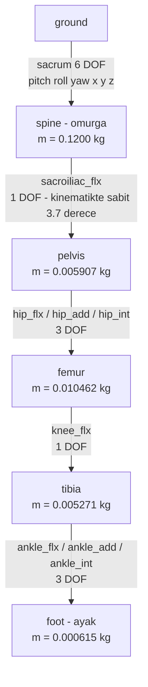
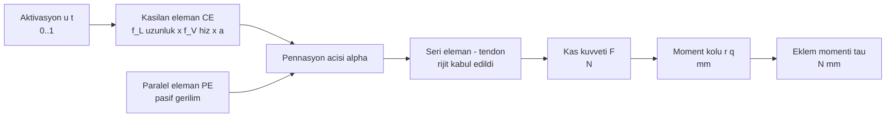

# D5 — Kas-iskelet yapısı: segmentler, serbestlik dereceleri, 38 kas

Model: `01_model/rat_hindlimb_faz1a.osim`. Tabanı Johnson ve ark. 2008 sıçan arka bacak
geometrisidir; segmentler ve eklemler aşağıdadır.

**Sayım:** 5 segment `[ölçüldü]`, 14 koordinat, bunun **7'si bacak ekseni**
(kalça 3 + diz 1 + bilek 3). Statik optimizasyon bu 7 DOF'u kısıt olarak kullanır
(`03_kod/kod_02_swing_id_so.py`).

## Kinematik girdi: hangi eksen gerçekten hareket ediyor

`02_veri/rat_walk_bone_smooth.mot` — 201 örnek, çevrim süresi **T = 0,387 s** `[ölçüldü]`:

| Koordinat | Aralık | Durum |
|---|---|---|
| `hip_flx` | 9,01° … 65,42° | hareketli |
| `knee_flx` | −139,73° … −107,65° | hareketli |
| `ankle_flx` | −2,89° … 30,65° | hareketli |
| `sacrum_pitch` | 19,91° … 24,99° | hareketli (gövde eğimi) |
| `hip_add` | −10° sabit | **dondurulmuş** |
| `ankle_add` | −5° sabit | **dondurulmuş** |
| `hip_int`, `ankle_int`, `sacrum_roll/yaw/x/y/z` | 0 sabit | **dondurulmuş** |
| `sacroiliac_flx` | 3,7° sabit | **dondurulmuş** |

Yani ölçülmüş kemik açıları **düzlem içi üç eklemi** sürüyor; add/rot eksenleri sabit tutulmuş.
Bildiri "ölçülmüş kemik eklem açıları uygulanmıştır" derken kastedilen budur.

## Kas-tendon birimi (Hill tipi)

Modeldeki 38 kasın tamamı `Thelen2003Muscle` `[ölçüldü]`.

Uygulama ayrıntısı (`03_kod/kod_02_swing_id_so.py` başlığından):

- **rijit tendon:** `lm = sqrt((lmt − tsl)² + (lmo·sin α₀)²)`, `cos α = (lmt − tsl)/lm`
- `fL = exp(−(l̃−1)²/γ)`, `fPE` Thelen, `fV` Thelen `a = 1` kapalı formu
- Bilinen basitleştirme: `fV`'nin `(0,25 + 0,75a)` terimi ihmal edilmiş `[bayrak]`
- `F_max` aralığı modelde **0,35 – 16,48 N** `[ölçüldü]`
- Tendon boşluk boyu `tsl` modelde tanımlı ve sıfırdan farklı `[ölçüldü]`

## 38 kasın eklem-işlev haritası (ölçülmüş moment kollarından)

Referans poz: kalça +21,7°, diz −120°, bilek 0°. Değerler `04_kapali_dongu/cl_grid3d.npz`
moment kolu ızgarasından okundu ve `02_DOGRULAMA_KAYDI.md` A bölümündeki diz değerleriyle
tutarlıdır (RF +3,69 / +3,70; VL +3,72 / +3,73; SM −3,95 / −3,87 — fark, pozun kalça-bilek
bileşeninden). İşaret sözleşmesi: **kalça +** = fleksiyon, **diz +** = ekstansiyon,
**bilek +** = dorsifleksiyon.

`kararlılık` sütunu, moment kolunun işaretinin ızgaranın kaçta kaçında aynı kaldığını gösterir;
1,00 = tüm çalışma aralığında aynı işaret.

| Kas | Açılım | r_kalça (mm) | r_diz (mm) | r_bilek (mm) | F_max (N) | İşlev | kararlılık |
|---|---|---|---|---|---|---|---|
| IP | iliopsoas | **+5,41** | 0 | 0 | 13,95 | kalça fleksör | 1,00 |
| TFL | tensor fasciae latae | **+8,47** | 0 | 0 | 2,63 | kalça fleksör | 1,00 |
| RF | rectus femoris | **+4,17** | **+3,69** | 0 | 14,79 | kalça fleksör + diz ekstansör | 0,92 / 1,00 |
| GMa | gluteus maximus | **+5,39** | 0 | 0 | 5,42 | modelde kalça fleksör — **anatomiyle çelişki, bkz. not** | 1,00 |
| GMe | gluteus medius | +2,15 | 0 | 0 | 16,48 | kalça fleksör (zayıf) | 1,00 |
| SM | semimembranosus | **−12,39** | **−3,95** | 0 | 9,39 | kalça ekstansör + diz fleksör | 1,00 |
| BFp | biceps femoris post. | **−11,95** | **−13,70** | 0 | 12,20 | kalça ekstansör + diz fleksör | 1,00 |
| STa | semitendinosus ant. | **−14,04** | **−15,54** | 0 | 2,63 | kalça ekstansör + diz fleksör | 1,00 |
| STp | semitendinosus post. | −9,94 | **−15,28** | 0 | 0,70 | kalça ekstansör + diz fleksör | 1,00 |
| GP | gracilis posterior | **−15,23** | **−12,28** | 0 | 2,06 | kalça ekstansör + diz fleksör | 1,00 |
| GA | gracilis anterior | −7,06 | −9,31 | 0 | 1,24 | kalça ekstansör + diz fleksör | 1,00 |
| AB | adductor brevis | −8,51 | 0 | 0 | 1,19 | kalça ekstansör/addüktör | 1,00 |
| AM | adductor magnus | −7,76 | 0 | 0 | 5,84 | kalça ekstansör/addüktör | 1,00 |
| AL | adductor longus | −5,57 | 0 | 0 | 4,37 | kalça ekstansör/addüktör | 1,00 |
| QF | quadratus femoris | −4,59 | 0 | 0 | 2,68 | kalça ekstansör | 1,00 |
| CF | caudofemoralis | −3,95 | 0 | 0 | 1,90 | kalça ekstansör | 0,85 |
| GI | gemellus inferior | −2,49 | 0 | 0 | 2,59 | kalça ekstansör (zayıf) | 1,00 |
| GS | gemellus superior | −1,00 | 0 | 0 | 0,35 | kalça ekstansör (zayıf) | 1,00 |
| Pir | piriformis | −1,30 | 0 | 0 | 10,16 | zayıf / kararsız | 0,77 |
| GMi | gluteus minimus | −0,53 | 0 | 0 | 6,71 | zayıf / kararsız | 0,77 |
| OI | obturator internus | −1,08 | 0 | 0 | 2,68 | zayıf | 0,92 |
| OE | obturator externus | +0,20 | 0 | 0 | 6,45 | zayıf / kararsız | 0,62 |
| Pec | pectineus | +0,20 | 0 | 0 | 3,31 | zayıf / kararsız | 0,62 |
| BFa | biceps femoris ant. | −1,01 | 0 | 0 | 3,24 | zayıf / kararsız | 0,62 |
| VL | vastus lateralis | 0 | **+3,72** | 0 | 12,92 | diz ekstansör | 1,00 |
| VI | vastus intermedius | 0 | **+3,71** | 0 | 2,85 | diz ekstansör | 1,00 |
| VM | vastus medialis | 0 | **+3,69** | 0 | 4,56 | diz ekstansör | 1,00 |
| Pop | popliteus | 0 | −1,58 | 0 | 2,62 | diz fleksör (zayıf) | 0,92 |
| MG | gastrocnemius med. | 0 | −3,43 | **−3,96** | 10,17 | diz fleksör + plantar fleksör | 0,92 / 1,00 |
| LG | gastrocnemius lat. | 0 | −3,08 | **−3,98** | 12,84 | diz fleksör + plantar fleksör | 0,92 / 1,00 |
| Pla | plantaris | 0 | −4,13 | **−3,96** | 5,40 | diz fleksör + plantar fleksör | 1,00 |
| Sol | soleus | 0 | 0 | **−4,00** | 1,34 | plantar fleksör | 1,00 |
| TP | tibialis posterior | 0 | 0 | −1,88 | 3,95 | plantar fleksör | 1,00 |
| FDL | flexor digitorum longus | 0 | 0 | −2,25 | 9,12 | plantar fleksör / parmak fleksörü | 1,00 |
| FHL | flexor hallucis longus | 0 | 0 | −2,26 | 0,62 | plantar fleksör / parmak fleksörü | 1,00 |
| TA | tibialis anterior | 0 | 0 | **+3,43** | 7,93 | dorsifleksör | 1,00 |
| EDL | extensor digitorum longus | 0 | −0,54 | **+2,48** | 1,88 | dorsifleksör | 1,00 |
| Per | peroneus | 0 | 0 | **+2,46** | 6,84 | modelde dorsifleksör | 1,00 |

## Uyarılar

- **GMa (gluteus maximus) modelde kalça fleksörü çıkıyor** (+5,39 mm, ızgaranın tamamında aynı
  işaret). Sıçan anatomisinde gluteus maximus kalça ekstansörüdür. Bu ya bir eklem merkezi /
  bağlantı noktası hatası ya da işaret sözleşmesi farkıdır; **model ile anatomi arasındaki bu
  çelişki çözülmeden GMa'ya dayanan bir bulgu yazılmaz.** (Açık soru.)
- `Pir`, `GMi`, `OE`, `Pec`, `BFa` için moment kolu hem küçük hem işaret olarak kararsız
  (kararlılık ≤ 0,77). Bu kaslar işlevsel gruplara **atanmaz**; motonöron havuzları kurulur ama
  antagonist eşleşmesine sokulmaz.
- Bilek addüksiyon/rotasyon eksenleri ile kalça addüksiyon/rotasyon momentleri bu tabloda yok;
  yalnız üç ana eksen (kalça fleksiyon, diz, bilek fleksiyon) gösterildi.
- Quadriceps'in +3,7 mm'sinin **anatomiden değil, `femur_dist` sarma torusundan** geldiği
  ölçülmüştür (`02_DOGRULAMA_KAYDI.md` H1). Ayrıntı PREPRINT bölüm 10'da.
