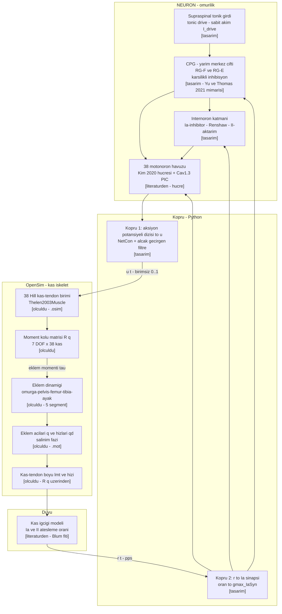
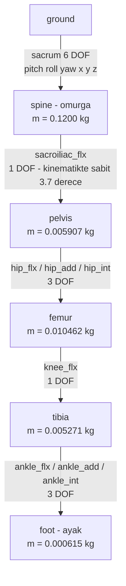
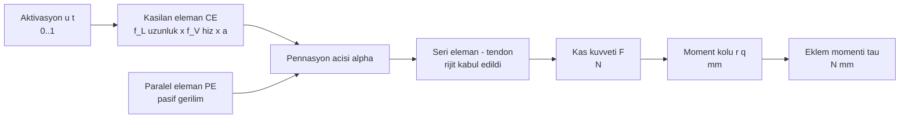
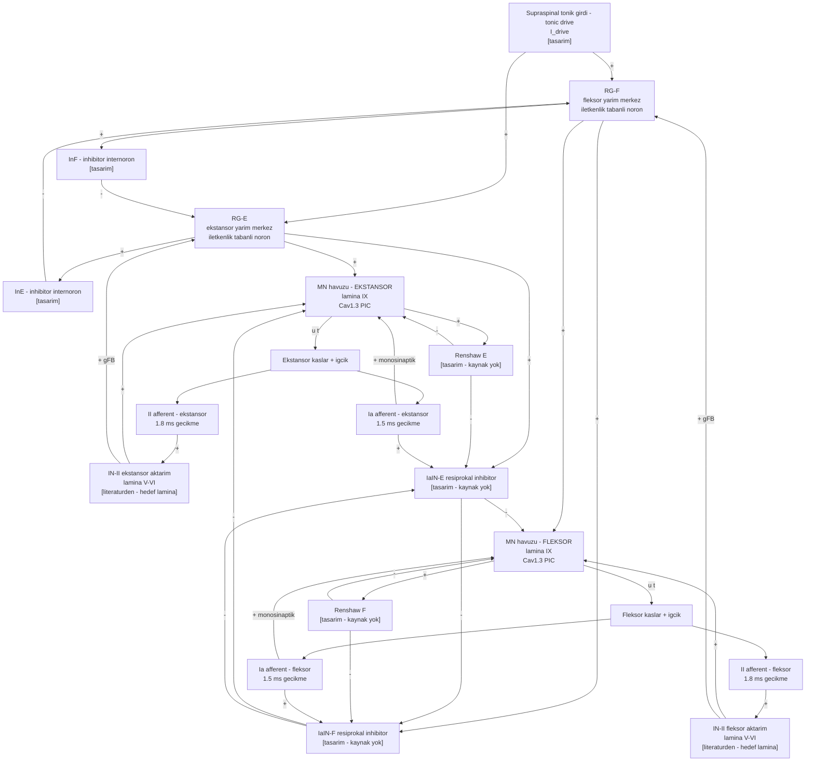
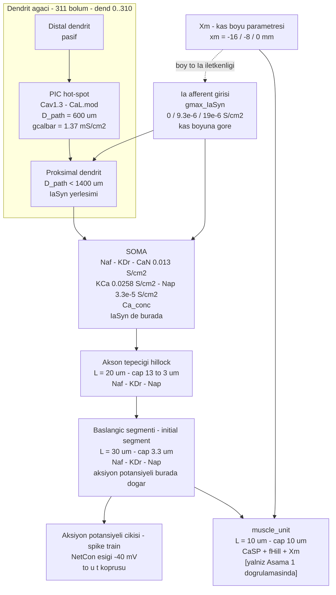
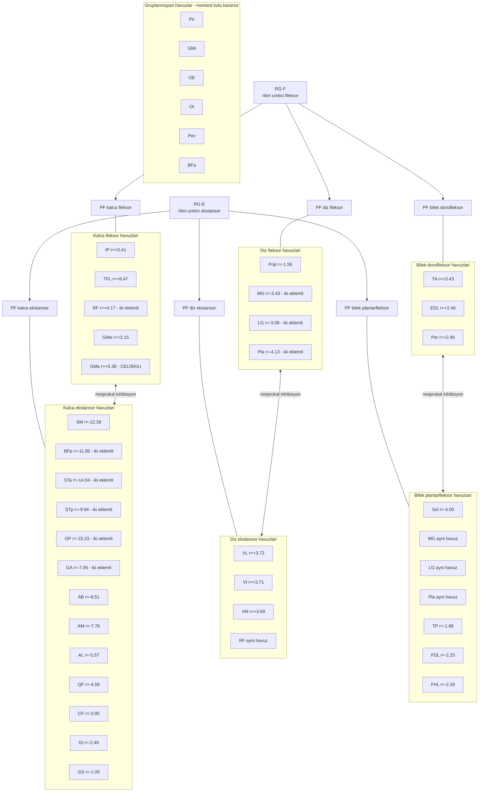
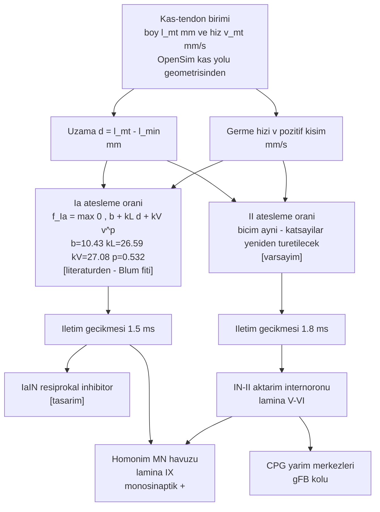
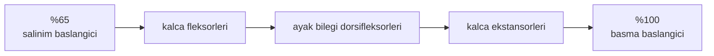
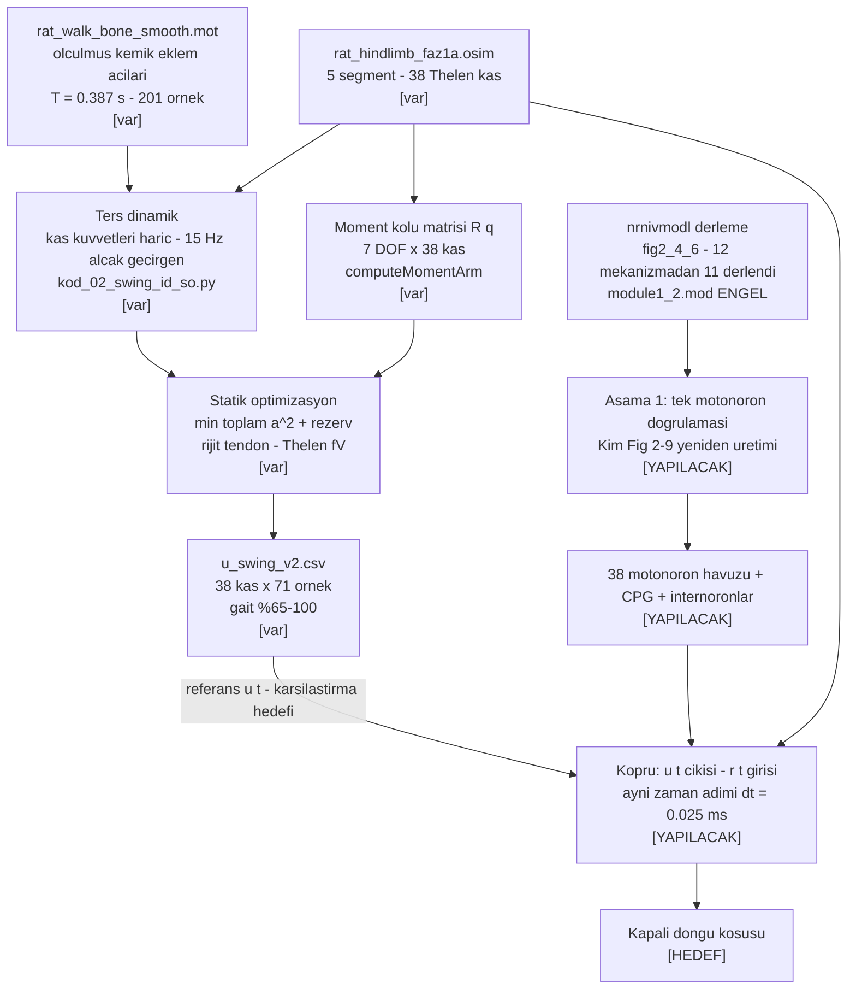
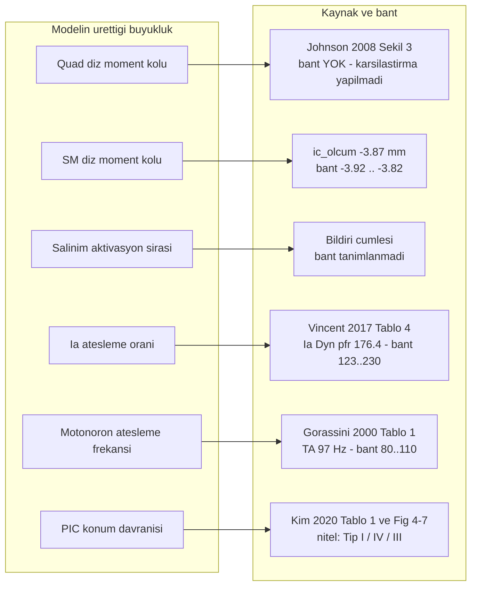

# PREPRINT — Sıçan Arka Bacağının Nöromekanik Kapalı-Döngü Modeli

**Proje:** USK26 — "Sıçan arka bacak hareketinin OpenSim ve NEURON ile nöromekanik modellenmesi"
**Son güncelleme:** 05.09.2026

---

## 1 · Bu dosya nedir

Bu dosya **projenin tek doğruluk kaynağıdır.** "Projemiz ne?" sorusunun cevabı burasıdır.
Yöntem, model yapısı, sayılar ve iddialar burada yazılıdır; kod ve veri dosyaları bunun
uygulamasıdır, tersi değil.

Kurallar:

- **Kaynağı yazılamayan sayı bu dosyaya girmez.** Her sayının yanında kaynağı yazılıdır: ya bir
  yayın (`literatur/oz_*.md` literatür özeti üzerinden, tablo/şekil numarasıyla), ya bu çalışmada
  üretilmiş bir dosyanın yolu (`.osim` model, `.mot` kinematik, `.csv` sonuç, `.py`/`.hoc` kod).
- Her ifade bir **durum etiketi** taşır:
  `[ölçüldü]` bu çalışmada ölçülmüş · `[literatürden]` bir yayından alınmış ·
  `[tasarım]` model kararı · `[varsayım]` henüz kaynağı olmayan seçim ·
  `[yapılacak]` planlanmış ama yapılmamış.
- **Terimler literatürdeki karşılıklarıyla kullanılır.** Türkçesi yerleşmemiş bir terim, ilk
  geçtiği yerde İngilizce özgün biçimiyle birlikte yazılır; uydurma karşılık kullanılmaz.
  Terim listesi bölüm 16'dadır.
- **Bildiri özeti (bölüm 3) değiştirilemez.** Çalışma ondan saparsa sapma bölüm 10'da yazılır,
  özet düzeltilmez.
- Diyagramların kaynağı `literatur/diyagramlar/`'dır; buraya kopya olarak gelirler.
  Bir diyagram değişecekse **önce orada** düzeltilir.

Bağlı belgeler: proje durumu `SDLC/00_DURUM.md` · kurallar `SDLC/04_KURALLAR.md` ·
doğrulama kaydı `DOGRULAMA.md` · literatür özetleri `literatur/oz_*.md`.

---

## 2 · Ne yapmaya çalışıyoruz

Sprague-Dawley sıçanının **yürüyüşünü** modelliyoruz. Amaç lokomosyonu *in silico* üretmek:
canlı hayvana ihtiyaç duymadan, **omurilikten kasa uzanan kapalı döngüyü** bilgisayarda kurmak.

Döngü şudur: omurilikteki merkezi örüntü üreteci (CPG) ve internöronlar motonöron havuzlarını
sürer; motonöronlar kasları etkinleştirir; kaslar eklem momenti ve hareket üretir; hareket kas
iğciklerinde duyusal sinyal doğurur; Ia ve II afferentleri bu sinyali omuriliğe geri taşır ve
komutu yeniler. **Kapalı olan budur.** Bu döngünün anlaşılması, omurilik yaralanmasında
nöroprotez geliştirme çalışmalarının temelidir.

**Ekip iki kişi.** Nöron tarafı (NEURON: CPG, internöronlar, motonöron havuzu, Ia afferent) ve
mekanik taraf (OpenSim: kas-iskelet, Hill kas modeli, ters dinamik, statik optimizasyon).
Bu repo ikisinin buluştuğu yerdir.

**Bugünkü durum tek cümlede:** döngünün kas-iskelet yarısı kurulmuş ve salınım fazı kas
aktivasyonları elde edilmiştir `[ölçüldü]`; omurilik yarısı için NEURON seçilmiş ve mimarisi
tasarlanmıştır `[tasarım]`, kurulumu sürmektedir.

---

## 3 · Bildiri özeti (kabul edilen metin — DOKUNULMAZ)

> Bu bölüm referanstır, düzenlenmez. Aşağıdaki her cümle bir taahhüttür; çalışmanın ona sadık
> kalması gerekir. Sapma varsa bölüm 10'da tartışılır.

**Amaç:** Lokomosyon, sinir komutlarıyla kasların hareket ürettiği ve duyusal geri beslemenin
komutları yenilediği kapalı döngüdür. Bu döngünün anlaşılması, omurilik yaralanmalarında
nöroprotez geliştirme çalışmaları için önemlidir. Bilgisayar modelleri, döngüye ilişkin
hipotezlerin canlı modellere ihtiyaç olmadan denenmesini sağlamaktadır. Çalışmanın amacı,
sıçan arka bacak kas-iskelet modelini omurilik sinir modeliyle birleştirip döngünün bilgisayar
modelini oluşturmaktır.

**Gereç-Yöntem:** Sprague-Dawley sıçanının anatomik modelinde, omurga, pelvis, femur, tibia ve
ayak segmentlerini kapsayan Johnson ve ark. (2008) kas-iskelet modeli temel alınmıştır. Kas
yolları, sıçan anatomi atlasıyla kontrol edilip güncellenmiştir. Kas-iskelet sisteminin kinetik
ve kinematiği OpenSim yazılımında Hill oranı kullanılarak hesaplanmıştır. Maksimum kuvvet
tanımları, kas kesit alanı ölçümleri kullanılarak tanımlanmıştır. Uyluk, baldır ve ayak
kütleleri ile eylemsizlik büyüklükleri, literatür çalışmalarından model boyutuna
ölçeklenmiştir. Modele, sıçan yürüyüşünden ölçülmüş kemik eklem açıları uygulanmıştır.
Çözümleme, ayağın yere değmediği ve yer tepki kuvveti gerektirmeyen salınım fazında
yapılmıştır. Ters dinamik ile bu fazın gerektirdiği eklem momentleri hesaplanmıştır. Statik
optimizasyon uygulanarak momentler toplam kas eforu en az olacak biçimde dağıtılmış ve her
kasın aktivasyon zaman serisi elde edilmiştir. Döngünün diğer yarısı olan omurilik devresi
için, sinir hücrelerini simüle eden NEURON yazılımı seçilmiştir.

**Bulgular:** Ekstansör kasların diz moment kolları pozitif, fleksör kasların ise negatif
işaretlidir. Quadriceps kaslarında moment kol uzunluğu yaklaşık olarak +3,7 mm'dir.
Semimembranosus kasında ise -4,1 mm olarak hesaplanmıştır. Modelin kas yolu geometrisinden
hesapladığı moment kolları, kaynak çalışmanın deneysel ölçümleriyle uyumludur. Salınım fazının
başında kalça fleksörleri, ortasında ayak bileği dorsifleksörleri, sonunda kalça ekstansörleri
etkindir.

**Sonuç:** Kapalı döngünün kas-iskelet tarafı oluşturulmuş ve salınım fazı kas aktivasyonları
elde edilmiştir. Deneysel çalışmalar ile model güncellenip basma fazı çözülecektir. Model,
hipotezlerin invaziv deneyler olmadan sınanmasına ve nöroprotez çalışmalarına temel
oluşturacaktır.

**Anahtar Kelimeler:** lokomosyon, NEURON, nöromekanik modelleme, OpenSim, sıçan arka bacağı

---

## 4 · Sistem mimarisi

> Diyagram kaynağı: `literatur/diyagramlar/D1_sistem_kapali_dongu.md`



Mermaid çizmeyen bir editör için aynı şekil:

```
   NEURON  (omurilik)                                 OpenSim  (kas-iskelet)
 ┌──────────────────────────┐                    ┌──────────────────────────────┐
 │ supraspinal tonik girdi  │                    │  38 Hill kas-tendon birimi   │
 │            │             │                    │            │                 │
 │            ▼             │      u(t)          │            ▼                 │
 │   CPG  (RG-F ⇄ RG-E)     │  ───────────────►  │  moment kolu R(q) · 7 DOF    │
 │            │             │   birimsiz 0..1    │            │                 │
 │            ▼             │                    │            ▼                 │
 │   internöron katmanı     │                    │  eklem dinamiği (5 segment)  │
 │   (Ia-inh · Renshaw · II)│                    │            │                 │
 │            │             │                    │            ▼                 │
 │            ▼             │                    │  q(t), q̇(t)  →  l_mt , v_mt  │
 │  38 motonöron havuzu     │                    │            │                 │
 │  (Cav1.3 PIC)            │                    │            ▼                 │
 │            ▲             │      r(t)          │      kas iğciği (Ia, II)     │
 │            └─────────────┼──◄─────────────────┼────────────┘                 │
 └──────────────────────────┘   pps + gecikme    └──────────────────────────────┘
```

### 4.1 · Döngüde taşınan değişkenler

| Sembol | Ne | Birim | Yön | Durum |
|---|---|---|---|---|
| `u(t)` | kas aktivasyon komutu, kas başına bir sayı | birimsiz 0–1 | NEURON → OpenSim | köprü `[tasarım]`; bugünkü karşılığı `veri/u_swing_v2.csv` `[ölçüldü]` |
| `r(t)` | Ia ve II afferent ateşleme oranı, kas başına | pps (≈ Hz) | OpenSim → NEURON | model `[literatürden]`, köprü `[tasarım]` |
| `q`, `q̇` | eklem açıları ve hızları, 7 bacak DOF | rad, rad/s | OpenSim içi | `[ölçüldü]` |
| `τ` | eklem momenti | N·mm | OpenSim içi | `[ölçüldü]` |
| `l_mt`, `v_mt` | kas-tendon boyu ve hızı | mm, mm/s | OpenSim → iğcik | `[ölçüldü]` |
| `F` | kas kuvveti | N | OpenSim içi | `[ölçüldü]` |

### 4.2 · Zaman ve gecikmeler

| Büyüklük | Değer | Kaynak | Durum |
|---|---|---|---|
| NEURON entegrasyon adımı | 0,025 ms | `oz_kim2020` §3d; `oz_fietkiewicz2025` §3d | `[literatürden]` |
| İki simülatörün aynı zaman adımıyla eşzamanlı ilerletilmesi | aynı `dt` ile tek Python döngüsü | `oz_fietkiewicz2025` §3b | `[literatürden]` yöntem |
| Ia iletim gecikmesi (sıçan) | 1,5 ± 0,2 ms | `oz_vincent2017` Tablo 4 | `[literatürden]` |
| II iletim gecikmesi (sıçan) | 1,8 ± 0,4 ms | `oz_vincent2017` Tablo 4 | `[literatürden]` |
| Efferent gecikme | seçilecek (Kim kedide toplam 10 ms) | `oz_kim2020` §3a | `[varsayım]` |
| Yürüyüş çevrimi | T = 0,387 s | `veri/rat_walk_bone_smooth.mot` | `[ölçüldü]` |

### 4.3 · Mimarinin iki kesin kuralı

1. **Kas dinamiği OpenSim'dedir.** Kim'in NEURON modeli kendi içinde bir `muscle_unit` bölmesi
   taşır (`CaSP` + `fHill`); o bölme yalnız Aşama 1 doğrulamasında kullanılır, kapalı döngüde
   devre dışıdır. Aksi halde kuvvet iki kez üretilmiş olur.
2. **Kas başına bir motonöron havuzu.** 38 kas → 38 havuz (bölüm 6.4).

---

## 5 · Kas-iskelet tarafı (OpenSim)

> Diyagram kaynağı: `literatur/diyagramlar/D5_kas_iskelet.md`
> Model dosyası: `model/rat_hindlimb_faz1a.osim`



### 5.1 · Model künyesi

| Özellik | Değer | Durum |
|---|---|---|
| Taban | Johnson ve ark. 2008 sıçan arka bacak geometrisi | `[literatürden]` |
| Segment | 5: spine, pelvis, femur, tibia, foot | `[ölçüldü]` — `DOGRULAMA.md` H2 |
| Koordinat | 14; **7'si bacak ekseni** (kalça 3 + diz 1 + bilek 3) | `[ölçüldü]` |
| Kas | 38, tamamı `Thelen2003Muscle` (Hill tipi) | `[ölçüldü]` |
| `F_max` aralığı | 0,35 – 16,48 N | `[ölçüldü]` |
| Segment kütleleri | spine 0,1200 · pelvis 0,005907 · femur 0,010462 · tibia 0,005271 · foot 0,000615 kg | `[ölçüldü]` |
| Tendon | modelde `tendon_slack_length` tanımlı; çözümde **rijit tendon** kabulü | `[ölçüldü]` + `[tasarım]` |
| Denek | dişi Sprague-Dawley, 280 ± 16 g (Johnson'ın kadavraları) | `[literatürden]` |

### 5.2 · Kinematik girdi

`veri/rat_walk_bone_smooth.mot` — 201 örnek, T = 0,387 s `[ölçüldü]`:

| Koordinat | Aralık | Durum |
|---|---|---|
| `hip_flx` | 9,01° … 65,42° | hareketli |
| `knee_flx` | −139,73° … −107,65° | hareketli |
| `ankle_flx` | −2,89° … 30,65° | hareketli |
| `sacrum_pitch` | 19,91° … 24,99° | hareketli |
| `hip_add` / `ankle_add` | −10° / −5° sabit | dondurulmuş |
| `hip_int`, `ankle_int`, `sacroiliac_flx`, diğer sacrum | sabit | dondurulmuş |

Yani ölçülmüş kemik açıları **düzlem içi üç eklemi** sürer; addüksiyon ve rotasyon eksenleri
sabittir. Bildirinin "ölçülmüş kemik eklem açıları uygulanmıştır" cümlesinin karşılığı budur.

### 5.3 · Hill tipi kas-tendon birimi



Uygulama (`kod/opensim/kod_02_swing_id_so.py`):

- rijit tendon: `lm = sqrt((lmt − tsl)² + (lmo·sin α₀)²)`, `cos α = (lmt − tsl)/lm`
- `fL = exp(−(l̃−1)²/γ)`, `fPE` Thelen, `fV` Thelen `a = 1` kapalı formu
- bilinen basitleştirme: `fV`'nin `(0,25 + 0,75a)` terimi ihmal edilmiş `[bilinen sapma]`

### 5.4 · Salınım fazı çözümü: ters dinamik + statik optimizasyon

1. **Ters dinamik** — kas kuvvetleri hariç, 15 Hz alçak geçirgen; salınım fazının gerektirdiği
   eklem momentleri `τ_ID` elde edilir `[ölçüldü]`.
2. **Moment kolu matrisi** `R(q)` — 7 DOF × 38 kas, OpenSim `computeMomentArm` `[ölçüldü]`.
3. **Statik optimizasyon** — `min Σa² + 1e6·Σr²` kısıtı `R·F(a) + R·F_pasif + r = τ_ID`;
   çıktı her kasın aktivasyon zaman serisi `[ölçüldü]`.
4. Çıktı: `veri/u_swing_v2.csv` — 38 kas × 71 örnek, gait %65–100.

Salınım fazı seçilmiştir çünkü ayak yere değmez ve **yer tepki kuvveti gerekmez**; ölçülmemiş bir
dış kuvvet varsayımı yapılmaz. Bu, bildirinin yöntem taahhüdüdür.

---

## 6 · Omurilik tarafı (NEURON) — tasarım

Bildiri özeti bu taraf için yalnız şunu taahhüt eder: *"Döngünün diğer yarısı olan omurilik
devresi için, sinir hücrelerini simüle eden NEURON yazılımı seçilmiştir."* Aşağıdaki mimari
o seçimin **açılımıdır**; kurulum sürmektedir ve hiçbir sonuç henüz iddia edilmemektedir.

### 6.1 · Devrenin temel motifi (bir antagonist çift)

> Diyagram kaynağı: `literatur/diyagramlar/D2_omurilik_devresi.md`
> Oklar: `+` eksitatör, `−` inhibitör. Aynı motif kalça, diz ve ayak bileği için tekrarlanır.



| Katman | İşlev | Kaynak | Durum |
|---|---|---|---|
| Supraspinal tonik girdi (tonic drive) | ritmi başlatan sabit girdi | — | `[tasarım]` |
| CPG yarım-merkezleri (half-centers) | karşılıklı inhibisyonla ritim üretir | `oz_yu2021` §3a — Morris-Lecar HCO | `[literatürden]` mimari |
| `gFB` / `gCPG` dengesi | ritmin ne kadarı merkezden, ne kadarı duyudan | `oz_yu2021` §4b | `[literatürden]` ödünleşim |
| Ia monosinaptik eksitasyon | germe refleksinin doğrudan kolu | `oz_vincent2017` §4b — Ia varikoziteleri lamina IX'ta ≥30 µm gövdelerle temas | `[literatürden]` anatomik kanıt |
| II → lamina V/VI aktarımı | II bilgisi internöron üzerinden gider | `oz_vincent2017` §4b | `[literatürden]` |
| IaIN (resiprokal inhibisyon) | antagonist havuzu susturur | **literatür özetlerinde kaynak yok** | `[tasarım]` |
| Renshaw (rekürren inhibisyon) | havuzun çıkışını sınırlar | **literatür özetlerinde kaynak yok** | `[tasarım]` |

**Dürüstlük notu:** `IaIN` ve `Renshaw` bu projenin literatür setinde kaynağı olmayan iki
bileşendir. **Karar (05.09.2026):** ilk sürümde devrededirler, `[tasarım]` etiketiyle —
ama **iddia edilmezler**. Uygulamada (`kod/kopru/nrn_devre.py`) tek bölmeli, Kim'in kendi
`Naf`/`KDr` mekanizmalarıyla kurulmuş internöronlardır; yeni bir hücre modeli uydurulmamıştır.
Ağırlıkları `kod/kopru/devre_par.json`'dadır ve `iain_etkin` / `renshaw_etkin` bayraklarıyla
kapatılabilirler, böylece katkıları ölçülebilir. Kaynak bulunana kadar bu ikisine dayanan
hiçbir sonuç bildirilmeyecektir; CPG'nin kendi karşılıklı inhibisyonu zaten fleksör/ekstansör
almaşmasını üretir.

**Neden yarım-merkez:** `oz_yu2021` §4b, salt ileri beslemeli sistemin yalnız simetrik çevrim
ürettiğini, geri besleme eklenince yeni davranışların (asimetrik çevrimler, zincir-refleks ritmi)
doğduğunu gösterir. Yani kapalı döngü kurulmadan CPG anlaşılamaz — bu, bildirinin "lokomosyon
kapalı döngüdür" cümlesinin dinamik sistem karşılığıdır. Aynı kaynağın uyarısı da geçerlidir:
`gFB` büyüdükçe dış pertürbasyona gürbüzlük artar, **iç (duyusal) gürültüye hassasiyet de artar**.

### 6.2 · Motonöron hücresi

> Diyagram kaynağı: `literatur/diyagramlar/D3_motonoron_hucre.md`
> Uygulama: `neuron/fig2_4_6/` (Kim 2020)



**Parametre tablosu** (kaynaklar: `oz_kim2020_piclokasyonu.md` ve
`neuron/fig2_4_6/` altındaki `.hoc` dosyaları):

| Parametre | Değer | Birim | Kaynak | Durum |
|---|---|---|---|---|
| Morfoloji | vemoto6, Cullheim 1987 hücre 43/5 düzeltmesi | — | `oz_kim2020` §3a | `[literatürden]` |
| Dendrit bölüm sayısı | 311 (`dend[0..310]`) | adet | `group_Ia.hoc` | `[literatürden]` |
| Soma kanalları | Naf, KDr, CaN, KCa, Nap, Ca_conc | — | `mem_mechanism_acti.hoc` | `[literatürden]` |
| `gcanbar_CaN` | 0,013 | S/cm² | `mem_mechanism_acti.hoc` | `[literatürden]` |
| `gkcabar_KCa` | 0,0258 | S/cm² | `mem_mechanism_acti.hoc` | `[literatürden]` |
| `gnapbar_Nap` | 3,3·10⁻⁵ | S/cm² | `mem_mechanism_acti.hoc` | `[literatürden]` |
| Akson tepeciği | L = 20 µm, çap 13 → 3 µm | µm | `add_hil_is.hoc` | `[literatürden]` |
| Başlangıç segmenti | L = 30 µm, çap 3,3 µm | µm | `add_hil_is.hoc` | `[literatürden]` |
| PIC kanalı | Cav1.3 (`CaL.mod`), hot-spot | — | `add_pics_istim.hoc` | `[literatürden]` |
| PIC konumu `D_path` | 600 (100–1000 taranabilir) | µm | `add_pics_istim.hoc` | `[literatürden]` |
| `gcalbar` @ 600 µm | 1,37 | mS/cm² | Kim Tablo 1 | `[literatürden]` |
| Ia sinaps bölgesi | soma + `D_path` < 1400 µm | µm | `group_Ia.hoc`; Segev 1990 | `[literatürden]` |
| `gmax_IaSyn` | 0 / 9,3·10⁻⁶ / 19·10⁻⁶ (kısa/optimal/uzun kas) | S/cm² | `group_Ia.hoc` | `[literatürden]` |
| Diken algılama eşiği | −40 | mV | `oz_fietkiewicz2023` §3b | `[literatürden]`, motonöronumuz için yeniden seçilecek |
| Entegrasyon adımı | 0,025 | ms | `oz_kim2020` §3d | `[literatürden]` |

**PIC konumunun anlamı** (`oz_kim2020` §4b, Tablo 1): `gcalbar`, somaya ulaşan etkin Ca akımı
22 nA'da sabit kalacak şekilde konuma göre ayarlanır (100 µm → 1,57; 600 µm → 1,37;
1000 µm → 4,10 mS/cm²). Proksimal yerleşim doğrusal (Tip I), ara yerleşim histerezisli (Tip IV),
distal yerleşim genişlemiş kendini-sürdürme (Tip III) davranışı verir.

**Tür uyarısı** (`oz_kim2020` §6.1): bu sayılar **kedi** motonöronundan gelir. Yazarın kendi
uyarısı, sıçan gibi küçük dendritli-yüksek uyarılabilirlikli türlerde PIC-konum etkisinin
"considerably low" olabileceğidir. Sıçan modelimizde etki zayıf çıkarsa bu bir hata değil,
beklenen sonuçtur; kedi-ölçekli etki çıkarsa şüphelenmeliyiz.

### 6.3 · Kas boyu girişi (`Xm`)

Kim modelinde kas boyu üç ayrık değerle temsil edilir (`xm` = −16 / −8 / 0 mm) ve Ia iletkenliği
bu boya göre tablodan okunur. **Bizim tasarımımızda** `xm` sürekli bir değişkendir: OpenSim'den
gelen kas-tendon boyunun fonksiyonudur ve Ia iletkenliği sabit tablo yerine bölüm 7'deki iğcik
modelinin ürettiği `r(t)`'den türetilir `[tasarım]`.

### 6.4 · Motonöron havuzları ve kas eşleşmesi

> Diyagram kaynağı: `literatur/diyagramlar/D6_havuz_kas_eslesme.md`

**Kural:** OpenSim modelindeki her kasın bir motonöron havuzu vardır — **38 kas, 38 havuz**
`[tasarım]`. Havuzlar CPG'ye doğrudan değil, eklem başına bir **örüntü oluşturma katmanı**
(pattern formation, PF) üzerinden bağlanır.



**Neden eklem başına bir örüntü oluşturma katmanı:** tek bir yarım-merkez çifti yalnız iki faz
üretir. Ama kendi ölçümümüz (bölüm 9.2) üç eklemin farklı zamanlarda tepe yaptığını gösteriyor —
kalça fleksörleri %68,5, diz fleksörleri %76,0, ayak bileği dorsifleksörü %85,5. Tek fazlı bir
girdi bu gecikmeleri veremez. `[tasarım]` — gerekçesi kendi ölçümümüzdür.

| Karar | Seçim | Durum |
|---|---|---|
| Havuz sayısı | 38 (kas başına bir) | `[tasarım]` |
| Havuzdaki motonöron sayısı | ilk sürümde 1 temsilî hücre, sonra artırılacak | `[tasarım]` |
| Devreye alma (recruitment) | `F_max` sırasına göre Henneman büyüklük ilkesi (size principle) | `[tasarım]` |
| İki eklemli (biartiküler) kaslar | tek havuz, iki örüntü oluşturma katmanından girdi (RF, BFp, STa, STp, GP, GA, MG, LG, Pla, EDL) | `[tasarım]` |
| Antagonist eşleşme | eklem başına fleksör ⇄ ekstansör, moment kolu işaretinden | `[ölçüldü]` |
| Gruplanmayanlar | Pir, GMi, OE, OI, Pec, BFa — işaret kararsız | `[ölçüldü]` gerekçe |

**Havuz çıkışının doğrulama hedefleri** (`oz_gorassini2000` §7; bilinçli, serbest yürüyen sıçan):

| Kimlik | Değer | Bant |
|---|---|---|
| `mn_frekans_TA_swing` | 97 Hz | [80, 110] |
| `mn_frekans_SOL_yuruyus` | 28 Hz | [20, 35] |
| `mn_frekans_MGLG_ortagec` | 62–72 Hz | [50, 90] |
| `dublet_orani_hizli_uniteler` | ≥ %80 adım | [%50, %100] |
| `dublet_orani_yavas_SOL` | ~%18 adım | [%0, %30] |

Uyarı (`oz_gorassini2000` §6): MG/LG'de tek ünite aktivitesi gros-EMG zarfından kopuktur
(r² = 0,0015–0,010); tek ortak sürücü varsayımı soleus için savunulabilir, MG/LG için
sorgulanır. Ayrıca yavaş ünitelerde dublet yoktur — PIC'i tüm havuzlara aynı güçle koyarsak
yavaş motonöronlarda fazla dublet üretiriz.

---

## 7 · Duyusal geri besleme: kas iğciği ve afferentler

> Diyagram kaynağı: `literatur/diyagramlar/D4_igcik_afferent.md`



**Ia denklemi** (`veri/r_katsayilari_v3.json`, kayıt `Ia_kinematik_v3`) `[literatürden]`:

```
f_Ia = max( 0 , 10,43 + 26,59 · d[mm] + 27,08 · max(v,0)[mm/s]^0,532 )
```

Kaynak: Blum 2020 ham eğrileri, 7 Ia afferenti, medyan fit.

**II için durum:** aynı JSON açıkça *"II bu pakette YOK"* diyor; II katsayıları izlenebilir bir
kaynağa dayanmıyor `[varsayım]`. Vincent 2017 bantlarına yeniden fit edilecektir `[yapılacak]`.

**Kalibrasyon uyarısı** (aynı JSON, `surekli_hareket_sonumu`): sürekli hareket denemesinde ölçüm
ortalaması ~15 Hz iken statik tahmin ~90 Hz çıkıyor (≈6 kat aşırı). Fit **rampa-tut** protokolüne
uygundur; lokomotor kullanımda `r(t)` aşağı kalibrasyon gerektirir.

**Sıçan doğrulama bantları** (`oz_vincent2017` Tablo 4 ve §7; pasif triceps surae, 3 mm rampa-tut,
20 mm/s, diz 120°; bantlar ±1 SD):

| Büyüklük | Değer | Bant |
|---|---|---|
| Ia dinamik tepe frekansı | 176,4 pps | [123, 230] |
| Ia dinamik indeksi DI | 137,9 pps | [90, 186] |
| II dinamik tepe frekansı | 105,4 pps | [57, 154] |
| Ia eşik boyu | 0,2 mm | [0, 0,4] |
| II eşik boyu | 0,6 mm | [0, 1,2] |
| Ia yavaş rampa (4 mm/s) | 124,4 pps | [70, 179] |

`Stat(mfr)` test olarak alınmaz: SD ortalamayı aşıyor (30,1 ± 48,4) ve gruplar ayrışmıyor.

**Anatomik dayanak** (`oz_vincent2017` §4b): iğcik afferent varikozitelerinin %80'den fazlası
lamina V/VI + IX'ta; **Ia** lamina IX'a yanlı ve motor çekirdekte ≥30 µm gövdelerle temas ediyor
(Ia → α-motonöron monosinaptik bağlantımızın karşılığı); **II** lamina V/VI'ya yanlı, yani
motonörona aktarım internöronu üzerinden gider; **Ib** lamina IX'a hiç girmiyor.

---

## 8 · Köprü: `u(t)` çıkışı, `r(t)` girişi

Köprü, iki simülatörü tek bir Python denetim döngüsünde **aynı zaman adımıyla eşzamanlı**
ilerletir (`oz_fietkiewicz2025` §3b) `[tasarım]`:

```
her adimda (dt = 0.025 ms):
    1. NEURON'u bir adim ilerlet
    2. motonoron havuzlarinin aksiyon potansiyellerini oku -> u(t)
    3. u(t)'yi OpenSim kas aktivasyonlarina yaz
    4. OpenSim'i bir adim ilerlet
    5. kas-tendon boylarini ve hizlarini oku             -> l_mt, v_mt
    6. igcik modelinden r(t) hesapla, gecikmeyi uygula
    7. r(t)'yi Ia sinaps iletkenligine yaz               -> gmax_IaSyn
```

| Karar | Seçim | Kaynak | Durum |
|---|---|---|---|
| Aksiyon potansiyeli → aktivasyon | NetCon ile aksiyon potansiyelini algıla, alçak geçirgen filtreyle `u(t)` üret | `oz_fietkiewicz2023` §3b | `[tasarım]` |
| Değişken taşıma tekniği (NEURON içi) | `POINTER` / parametre-pointer | `oz_fietkiewicz2023` §3a-3b | `[literatürden]` yöntem |
| Ortak adım | 0,025 ms, sabit | `oz_fietkiewicz2025` §3d | `[literatürden]` |
| Sayısal kararlılık kontrolü | zaman adımını yarılayıp sonucun değişmediğini doğrulama (step-halving convergence check) | `oz_fietkiewicz2023` §5 | `[yapılacak]` — bizde **zorunlu**, çünkü kuplaj dışsal ve ortak Jacobian kurulamıyor |
| İki Python ortamı | NEURON 3.14 ana ortam, OpenSim 3.13 `.venv-osim` | `SDLC/06_KURULUM.md` | `[ölçüldü]` kısıt |

**Ortam kısıtı (risk):** `opensim` Python 3.14 için tekerlek yayımlamıyor; NEURON 3.14
gerektiriyor. Bu yüzden proje iki ortamlıdır. Köprünün bu iki ortamı nasıl buluşturacağı
(tek süreçte mi, süreçler arası mı) **açık bir tasarım sorusudur** — bölüm 14, soru 3.

**Doğrulama hedefi:** köprü kurulduğunda NEURON'un ürettiği `u(t)`, statik optimizasyonun
ürettiği `veri/u_swing_v2.csv` ile karşılaştırılacaktır. Bu iki sinyalin **aynı olması
beklenmez** (biri optimizasyon, diğeri devre çıktısı); beklenen, salınım fazı zamanlamasının
(bölüm 9.2) yeniden üretilmesidir.

---

## 9 · Bulgular

### 9.1 · Moment kolları

Ölçüm koşulu: diz açısı −120° (modelin varsayılan pozu). Kaynak:
`DOGRULAMA.md` A bölümü, 27.07.2026 bağımsız ölçüm oturumu.

| Büyüklük | Ölçülen | Durum |
|---|---|---|
| Quadriceps diz moment kolu | RF +3,70 · VL +3,73 · VI +3,72 · VM +3,70 mm | `[ölçüldü]` |
| Semimembranosus diz moment kolu | **−3,87 mm** | `[ölçüldü]` |
| İkinci yöntemle (uzunluk türevi) | RF +3,70 · VL +3,74 · VI +3,72 · VM +3,71; SM −3,87 | `[ölçüldü]` |
| Quadriceps tepe değeri | 3,75 mm @ −117° | `[ölçüldü]` |
| İşaret kuralı | ekstansör diz moment kolları pozitif, fleksörler negatif | `[ölçüldü]` |

Diz moment kolu tam listesi (mm, diz −120°):

| Kas | r | Kas | r |
|---|---|---|---|
| STa | −15,46 | RF | +3,70 |
| STp | −14,97 | VL | +3,73 |
| BFp | −13,77 | VI | +3,72 |
| GP | −12,33 | VM | +3,70 |
| GA | −9,39 | MG | −3,44 |
| Pla | −4,11 | LG | −3,23 |
| SM | −3,87 | Pop | −1,66 |

Bildirinin "ekstansör kasların diz moment kolları pozitif, fleksör kasların negatif" cümlesi
**doğrulanmıştır.** Quadriceps için "yaklaşık +3,7 mm" cümlesi de doğrulanmıştır. Semimembranosus
için bildiri −4,1 mm yazar; ölçülen −3,87 mm'dir (bölüm 10.1).

Üç eklemin tamamı için kas-işlev haritası `literatur/diyagramlar/D5_kas_iskelet.md`'dedir.

### 9.2 · Salınım fazı kas etkinlik sırası

> Diyagram kaynağı: `literatur/diyagramlar/D7_yuruyus_zamanlama.md`
> Veri: `veri/u_swing_v2.csv`, gait %65–100, 71 örnek.

Bildirinin iddiası:



Ölçülen sıra:


Kas kas tepe aktivasyon zamanları (tepe `a` > 0,005 olanlar; kalan 25 kas sessiz):

| Kas | Tepe `a` | Tepe zamanı (gait %) | Modelin moment kolundan işlevi |
|---|---|---|---|
| IP | 0,0770 | 69,0 | kalça fleksör |
| BFa | 0,0568 | 81,0 | **kararsız** (r −1,01, kararlılık 0,62) |
| GMa | 0,0458 | 82,5 | modelde kalça **fleksör** (+5,39) |
| FDL | 0,0439 | 87,0 | plantar fleksör |
| RF | 0,0436 | 66,5 | kalça fleksör + diz ekstansör |
| OE | 0,0280 | 72,0 | **kararsız** |
| TA | 0,0184 | 85,5 | dorsifleksör |
| BFp | 0,0128 | 65,0 | kalça ekstansör + diz fleksör |
| Pop | 0,0125 | 76,0 | diz fleksör |
| STp | 0,0118 | 77,0 | kalça ekstansör + diz fleksör |
| GMe | 0,0097 | 71,5 | kalça fleksör (zayıf) |
| TFL | 0,0087 | 65,0 | kalça fleksör |
| CF | 0,0054 | 100,0 | kalça ekstansör |

Tabloda geçen **kararlılık**, bu çalışmada tanımlanmış bir ölçüttür: kasın moment kolu işaretinin,
taranan eklem açısı ızgarasının (grid) kaçta kaçında aynı kaldığı. 1,00 = tüm çalışma aralığında
aynı işaret; 0,50 ≈ işaret rastgele değişiyor, o kasa işlev atanamaz.

Grup düzeyinde (moment kolu işaretine göre gruplanmış):

| Grup | Toplam aktivasyon | Grup tepe zamanı | Ağırlık merkezi |
|---|---|---|---|
| Kalça fleksörleri (IP, TFL, RF, GMe, GMa) | 7,851 | %68,5 | %78,4 |
| Diz ekstansörleri (VL, VI, VM, RF) | 1,431 | %66,5 | %76,5 |
| Diz fleksörleri (Pop, MG, LG, Pla) | 0,502 | %76,0 | %77,4 |
| Kalça ekstansörleri (13 kas) | **0,883** | %65,0 | %79,2 |
| Ayak bileği dorsifleksörleri (TA, EDL, Per) | 1,197 | %85,5 | %81,1 |
| Ayak bileği plantar fleksörleri (7 kas) | 1,444 | %87,0 | %86,3 |

Zaman çizelgesi:

```
gait %      65        70        75        80        85        90        95       100
            |---------|---------|---------|---------|---------|---------|---------|
IP          #########################################################################
RF          ##########################################################...............
TFL         ###......................................................................
GMe         .....######..............................................................
BFp         ###......................................................................
STp         ..............########...................................................
Pop         ..................######.................................................
BFa         ....#####################################################################
GMa         #########################################################################
TA          #####################################################################....
FDL         ..........................######################################..........
            ^tepe: RF 66.5  IP 69.0        Pop 76 STp 77   BFa 81 GMa 82.5  TA 85.5  FDL 87
```

**Okunuşu:** bildirinin sırasının ilk halkası (salınım başında kalça fleksörleri) doğrulanır.
Son iki halka yer değiştirir: ayak bileği dorsifleksörü fazın *ortasında* değil son üçte
birinde tepe yapar; kalça ekstansörleri ise salınım boyunca çok zayıftır. Ayrıntı ve bu
sonucun sınırları bölüm 10.4'tedir.

---

## 10 · Bildiri ile ölçüm arasındaki farklar

> Bunlar poster önünde sorulabilecek sorulardır; hazırlıksız yakalanmamak için açık yazılıyor.
> Kaynak: `DOGRULAMA.md`.

### 10.1 · Semimembranosus: bildiri −4,1 mm, ölçüm −3,87 mm

Bildiri **−4,1 mm** yazar. Repodaki modelde iki ayrı türev yöntemiyle ölçülen değer
**−3,87 mm**'dir (diz −120°; sarma açık ve kapalı halde **aynı**, fark 0,00 mm). Fark 0,23 mm,
yaklaşık %6.

Olası açıklamalar: farklı diz açısında ölçülmüş olması, farklı model sürümü, ya da bildiriye
yuvarlanarak veya başka bir kaynaktan girmiş olması.

**Bu preprintin kararı:** ölçülen değer **−3,87 mm** esastır (bölüm 9.1). Bildirideki −4,1 mm
burada kayıtlıdır; posterde hangisinin yazılacağı ayrı bir karardır (bölüm 14, soru 1).

Not: semimembranosus, modelin **en savunulabilir moment kolu sayısıdır**, çünkü sarma
nesnelerinden tamamen bağımsızdır.

### 10.2 · "Kas yolları anatomi atlasıyla kontrol edilip güncellenmiştir"

Repodaki modelde **38 kasın hepsi tam iki noktalıdır** (via point yok) `[ölçüldü]`. Johnson ise
Tablo 6'da quadriceps'in dört başı, TA, EDL, TP, FDL, FHL ve Peronei için birer **via point**
kaydeder. Yani model, kaynak çalışmanın kas yolu topolojisini yeniden üretmiyor.

Koordinatlar da birebir değil: modelin quadriceps insertion'ı tibia çerçevesinde
(2,60 · 37,50 · 0,50) mm, Johnson'ınki (2,03 · 40,99 · 1,68) mm.

Bu cümle, **hangi kasların hangi yönde güncellendiği** yazılmadan savunulamaz. Güncelleme
yapıldıysa kaydı bulunmalı; bulunamazsa poster metninde daraltılmalıdır (bölüm 14, soru 2).

### 10.3 · "Moment kolları kaynak çalışmanın deneysel ölçümleriyle uyumludur"

Bu, bildirinin en kırılgan cümlesidir. Doğrulama kaydının söyledikleri:

- **Johnson Şekil 3'teki quadriceps eğrisiyle karşılaştırma YAPILMADI.** Eksik olan tek geometri
  doğrulaması budur (D bölümü).
- Quadriceps'in +3,7 mm'sini **anatomi değil, `femur_dist` WrapTorus üretiyor** (H1). Sarma
  kapatıldığında quadriceps modelde *fleksör* oluyor (−0,65 … −1,18 mm). Değer torusun
  `inner_radius` alanına doğrudan bağlı: 2 mm → 2,94 · **4 mm → 3,71** · 5 mm → 4,02.
- Johnson'ın kendi via point'i taşınıp sarma kapatıldığında dört baş **+1,01 … +1,51 mm** veriyor
  — işaret doğru ama büyüklük yarıdan az ve dört başın kümelenmesi kayboluyor. Yani
  "0,03 mm içinde kümelenme" torusun ürettiği yapay bir sonuçtur, anatomik bulgu değildir (C bölümü).
- Johnson moment kolunu **farklı tanımlıyor**: kas etki doğrultusu birim vektörü ile yarıçap
  vektörünün dış çarpımı; bizimki `r = −dL/dθ`. İki tanımın aynı sayıyı vermesi zorunlu değildir
  (H6).
- "İki bağımsız yöntem" iddiası da zayıftır: `computeMomentArm` ve `getLength` + merkezi fark
  **aynı kas yolunu ve aynı sarma motorunu** kullanır; uyuşma türevi doğrular, geometriyi değil
  (H5).
- Lokomosyon penceresi de aynı değildir: Johnson'ın dörtayak diz aralığı −110° … −60°;
  bu çalışmanınki −123° … −54° (H7).

**Sonuç:** "deneysel ölçümlerle uyumludur" cümlesi bugün **kanıtsızdır**. Kanıtlanması için
Johnson Şekil 3 eğrisiyle sayısal karşılaştırma yapılmalıdır (bölüm 13, adım 0).

### 10.4 · Salınım fazı etkinlik sırası: son iki halka ters çıkıyor

Ölçüm bölüm 9.2'de. Bildirinin sırası kalça fleksör → dorsifleksör → kalça ekstansör; ölçülen
sıra kalça fleksör → diz fleksör → **dorsifleksör (%85,5)**.

Bu ölçümün sınırları:

1. **Gruplandırma tartışmalı.** Modelin kendi moment kolları GMa'yı kalça **fleksörü**
   (+5,39 mm), BFa'yı **kararsız** (−1,01 mm, işaret kararlılığı 0,62) gösteriyor. Bildirideki
   "sonunda kalça ekstansörleri" cümlesi, GMa ve BFa ekstansör sayılırsa yaklaşık doğrulanır
   (%81–82,5); modelin moment kolları esas alınırsa doğrulanmaz. **Önce GMa çelişkisi
   çözülmelidir** (bölüm 14, soru 4).
2. Tüm aktivasyonlar küçüktür (`a` ≤ 0,077); statik optimizasyonun min Σa² çözümü zayıf uyarılmış
   kasları eşit dağıtma eğilimindedir.
3. "Etkin" ölçütü **tepe zamanı** alınmıştır; bildiri bir etkinlik *penceresi* kastediyor olabilir.

### 10.5 · Bildirinin "seçilmiştir" sınırı

Bildiri omurilik tarafı için yalnız "NEURON seçilmiştir" der. Bu preprint bölüm 6'da **tam bir
mimari tasarım** verir; bu, bildirinin ötesine geçmek değil, seçimin açılımıdır. Ancak bölüm 6'daki
hiçbir bileşen bir **sonuç** olarak sunulmamaktadır: tamamı `[tasarım]` veya `[literatürden]`
etiketlidir ve NEURON tarafından üretilmiş tek bir sayı henüz yoktur.

---

## 11 · Sınırlılıklar ve bilinçli basitleştirmeler

| Basitleştirme | Bedeli | Kaynak |
|---|---|---|
| **Ib (Golgi tendon organı) yok** | Sıçanda Ib pasif germede susmuyor; salınımda omuriliğe giden gerçek afferent sinyalin bir bileşeni atlanıyor | `oz_vincent2017` §6 |
| **γ-motonöron (fusimotor) yok** | İğcik kazancı pasif; Vincent'ın bantları da pasif koşuldan, bu yüzden doğrulama tutarlı ama lokomosyona genellenemez | `oz_vincent2017` §6 |
| **Tek bacak, tek taraf** | Sol-sağ koordinasyon ve karşı bacak geri beslemesi yok | — |
| **Yalnız salınım fazı** | Basma fazı ve yer tepki kuvveti kapsam dışı (bildirinin kendi sınırı) | bildiri özeti |
| **Addüksiyon/rotasyon eksenleri dondurulmuş** | Kinematik girdi üç eklemi sürüyor; 3B etkiler yok | `[ölçüldü]` bölüm 5.2 |
| **Rijit tendon** | Tendon esnekliğinin lif boyu ve kuvvete etkisi yok | `kod/opensim/kod_02_swing_id_so.py` |
| **`fV`'de `(0,25+0,75a)` terimi ihmal** | Düşük aktivasyonlarda kuvvet-hız ilişkisi yaklaşık | aynı |
| **Motonöron modeli kediden** | PIC-konum etkileri sıçanda zayıf çıkabilir; yazarın kendi uyarısı | `oz_kim2020` §6.1 |
| **Afferent verisi Wistar sıçandan** | Bizim taban Sprague-Dawley; soy farkı bantların içinde varsayılıyor | `oz_vincent2017` §5 |
| **Motonöron ateşleme verisi Wistar, EMG'den** | Hücre içi kayıt değil; örneklem büyük/yüzeysel ünitelere yanlı | `oz_gorassini2000` §5 |
| **Statik optimizasyon min Σa²** | Ko-kontraksiyonu ve zayıf kasların dağılımını sistematik olarak etkiler | bölüm 5.4 |
| **Johnson modeli statiktir** | Kas kuvveti, PCSA, lif boyu, tendon özellikleri Johnson'da **yok**; Hill parametreleri başka kaynaktan gelmek zorunda | `oz_johnson2008` §6 |

---

## 12 · Doğrulama planı ve tolerans bantları

> Diyagram kaynağı: `literatur/diyagramlar/D8_veri_hatti_dogrulama.md`

İşlem hattı:



Doğrulama haritası:



**Kural** (`SDLC/04_KURALLAR.md`): bant testten **önce** gerekçesiyle ilan edilir; ölçüm banda
düşmezse önce model ve varsayımlar sorgulanır, bant sessizce genişletilmez. `literatur` ve
`ic_olcum` kayıtları karıştırılmaz: iç ölçüm bandı bir **regresyon** bandıdır, literatür
doğrulaması sayılmaz.

Bugün `literatur/referans_degerler.json`'da 6 kayıt vardır (2'si `ic_olcum`). Literatür
özetlerinde hazır olup JSON'a **henüz girmemiş** bantlar: Vincent'ın 6 afferent bandı,
Gorassini'nin 6 motonöron bandı, Kim'in eşik bandı, Johnson'ın BFA kalça moment kolu bandı
`[yapılacak]`.

---

## 13 · Yol haritası

| # | Adım | Çıktı | Bitti ölçütü | Durum |
|---|---|---|---|---|
| 0 | Johnson Şekil 3 karşılaştırması | quadriceps moment kolu eğrisi vs model | `johnson2008.quad_diz_moment_kolu_egrisi` kaydı bant ile doldurulur | `[yapılacak]` |
| 1 | GMa çelişkisinin çözümü | bağlantı noktası / işaret denetimi | GMa'nın kalça işlevi anatomiyle uyumlu hale gelir veya fark gerekçelenir | `[yapılacak]` |
| 2 | NEURON derlemesi | `module1_2.mod` `U` ve `phi` çakışmaları çözülür, 4 figür klasörü derlenir | `nrnivmodl` hatasız; `special` üretilir | **bitti** — `DOGRULAMA.md` N |
| 3 | Aşama 1: tek motonöron doğrulaması | Kim Fig 2–9 davranışının yeniden üretimi | `D_path` taraması Tip I / IV / III desenlerini verir; eşik-boy ilişkisi monoton | `[yapılacak]` |
| 4 | İğcik modeli sıçana kalibrasyon | Ia/II denklemleri | Vincent bantlarına düşer (bölüm 7) | `[yapılacak]` |
| 5 | 38 motonöron havuzu + CPG + internöronlar | NEURON devresi | havuz çıkışı Gorassini bantlarına düşer (bölüm 6.4) | **kısmen** — devre kuruldu, ayak bileğinde 10 havuz koşuyor; frekanslar henüz bantta değil (bölüm 10.6) |
| 6 | Köprü | `u(t)` çıkışı, `r(t)` girişi, aynı zaman adımı | zaman adımı yarılandığında sonuç değişmiyor | **bitti** — tek süreç, `dt_k` = 0,3 ms; bölüm 8 |
| 7 | Kapalı döngü koşusu | salınım fazının devre tarafından üretilmesi | zamanlama sırası bölüm 9.2 ile karşılaştırılır | **kısmen** — tek eklemde (ayak bileği) kapalı döngü koşuyor; 3 DOF / 38 havuz `[yapılacak]` |

Bildirinin "deneysel çalışmalar ile model güncellenip basma fazı çözülecektir" cümlesi bu yol
haritasının **ötesindedir** ve bu preprintin kapsamı dışındadır.

---

## 14 · Açık sorular (karar bekliyor)

1. **Semimembranosus: posterde −3,87 mm mi, −4,1 mm mi yazılacak?** Preprint ölçüleni esas alır;
   bildiri metni değişmez. Poster ikisinden birini seçmek zorunda.
2. **"Kas yolları güncellenmiştir" cümlesi neye dayanıyor?** Bir güncelleme kaydı var mı, yoksa
   cümle poster metninde daraltılmalı mı? (bölüm 10.2)
3. ~~**Köprü iki Python ortamını nasıl buluşturacak?**~~ **KAPANDI (05.09.2026).** `neuron==9.0.2`
   cp313 tekerleği yayımlıyor; ortak payda Python 3.13'tür. `~/.venvs/usk26-kopru` ortamında
   `import opensim` ve `from neuron import h` aynı süreçte, her iki import sırasında da
   çalışıyor ve iki simülatör de iş yapıyor `[ölçüldü]`. Köprü **tek süreçte, tek Python
   döngüsündedir**; süreçler arası iletişim gerekmiyor. `DOGRULAMA.md` M.
4. **GMa neden modelde kalça fleksörü çıkıyor?** Bağlantı noktası hatası mı, işaret kuralı
   farkı mı? Bu çözülmeden salınım fazı sıra bulgusu kesinleşmiyor. (bölüm 10.4)
5. ~~**IaIN ve Renshaw katmanları kalacak mı?**~~ **KARAR VERİLDİ (05.09.2026, kullanıcı):**
   ilk sürümde **devrededirler**, `[tasarım]` etiketiyle. Literatür setinde kaynakları
   olmadığı için **hiçbir sonuç bunlara dayandırılarak iddia edilmez**; bölüm 6.1'in dürüstlük
   notu aynen geçerlidir. `kod/kopru/devre_par.json` içindeki `iain_etkin` / `renshaw_etkin`
   bayraklarıyla kapatılabilirler, böylece etkileri ölçülebilir. (bölüm 6.1)
6. **Havuz büyüklüğü ne olacak?** Kas başına tek temsilî motonöron mu, gerçekçi havuz mu?
   Gorassini'nin dublet ve frekans bantları bir havuz gerektiriyor olabilir. (bölüm 6.4)

---

## 15 · Kaynaklar

Literatür özetlerinin tamamı `literatur/oz_*.md` dosyalarındadır; aşağıdaki liste her kaynağın projedeki
rolünü gösterir.

| Kaynak | Künye | Projedeki rolü |
|---|---|---|
| **Johnson ve ark. 2008** | *A three-dimensional model of the rat hindlimb: musculoskeletal geometry and muscle moment arms*, J Biomech 41(3):610–619 | Kas-iskelet modelinin geometri tabanı; moment kolu doğrulama referansı. Uyarı: model statiktir, Hill parametreleri buradan gelmez. |
| **Kim 2020** | *Linking Motoneuron PIC Location to Motor Function in Closed-Loop Motor Unit System Including Afferent Feedback*, eNeuro 7(2) | Motonöron hücresi, Cav1.3 PIC yerleşimi, Ia sinaps dağılımı, kapalı-döngü motor ünite mimarisi. Kedi kaynaklı. |
| **Vincent ve ark. 2017** | *Muscle proprioceptors in adult rat: mechanosensory signaling and synapse distribution in spinal cord*, J Neurophysiol 118:2687–2701 | Sıçan Ia/II afferent doğrulama bantları; Ia → lamina IX monosinaptik bağlantının anatomik kanıtı. |
| **Gorassini ve ark. 2000** | *Activity of Hindlimb Motor Units During Locomotion in the Conscious Rat*, J Neurophysiol 83:2002–2011 | Motonöron havuzu çıkışının doğrulama hedefleri: yürüyüşte frekanslar ve dublet oranları. |
| **Yu ve Thomas 2021** | *Dynamical consequences of sensory feedback in a half-center oscillator coupled to a simple motor system*, Biol Cybern 115:135–160 | CPG mimarisi ve `gFB`/`gCPG` ödünleşimi; yöntem şablonu. Parametre kaynağı değildir (Aplysia + Morris-Lecar). |
| **Fietkiewicz ve ark. 2023** | *Tutorial: using NEURON for neuromechanical simulations*, Front Comput Neurosci 17:1143323 | NEURON içi modül bağlama tekniği (`POINTER`, NetCon), süreksiz (non-smooth) dinamik, zaman adımı yarılama testi. |
| **Fietkiewicz ve ark. 2025** | *Neuromechanical Simulation with NEURON and MuJoCo* | İki simülatörün aynı zaman adımıyla eşzamanlı ilerletildiği köprü mimarisinin şablonu. Aynı iskelet tabanı (Johnson 2008) ama fizik motoru MuJoCo; bizim tercihimiz OpenSim. |
| **Blum 2020** | iğcik Ia fit verisi | `veri/r_katsayilari_v3.json`'daki Ia katsayılarının kaynağı. **Literatür özeti henüz yok** — `literatur/`'e eklenmeli. |

**Eksik kaynak uyarısı:** Blum 2020'nin literatür özeti bu klasörde yoktur; Ia denklemi bugün
özeti çıkarılmamış bir JSON kaydına dayanmaktadır. Ayrıca IaIN / Renshaw katmanlarının hiçbir
kaynağı yoktur (bölüm 6.1).

---

## 16 · Terimler

Bu belgede kullanılan Türkçe terimlerin literatürdeki özgün karşılıkları. Bir terimin Türkçesi
yerleşmemişse metinde ilk geçtiği yerde İngilizcesi parantez içinde verilir; **uydurma karşılık
kullanılmaz**, gerekirse terim doğrudan İngilizce yazılır.

Buradaki liste **bilimsel** terimleri kapsar. Süreç ve belge terimleri (repo, doğrulama kaydı,
gate, literatür özeti…) `SDLC/07_TERIMLER.md`'dedir; ikisi birbirini tekrar etmez.

### Sinir sistemi

| Bu belgede | Literatürdeki özgün terim |
|---|---|
| merkezi örüntü üreteci (MÖÜ) | central pattern generator (CPG) |
| yarım-merkez osilatör | half-center oscillator (HCO) |
| ritim üretici katman | rhythm generator (RG) |
| örüntü oluşturma katmanı | pattern formation (PF) layer |
| supraspinal tonik girdi | (supraspinal) tonic drive |
| mezensefalik lokomotor bölge | mesencephalic locomotor region (MLR) |
| internöron | interneuron |
| resiprokal inhibisyon | reciprocal inhibition |
| rekürren inhibisyon | recurrent inhibition |
| Renshaw hücresi | Renshaw cell |
| aktarıcı internöron | relay interneuron |
| motonöron havuzu | motoneuron pool |
| devreye alma / Henneman büyüklük ilkesi | recruitment / Henneman size principle |
| aksiyon potansiyeli (diken) | action potential (spike) |
| aksiyon potansiyeli dizisi | spike train |
| kalıcı içeri akım | persistent inward current (PIC) |
| yol uzaklığı (`D_path`) | path distance from soma |
| akson tepeciği | axon hillock |
| başlangıç segmenti | (axon) initial segment |
| kas iğciği | muscle spindle |
| birincil / ikincil afferent | group Ia / group II afferent |
| Golgi tendon organı | Golgi tendon organ (group Ib) |
| dinamik indeks | dynamic index (DI) |
| dublet / triplet | doublet / triplet |
| iletim gecikmesi | conduction delay |

### Kas-iskelet

| Bu belgede | Literatürdeki özgün terim |
|---|---|
| kas-tendon birimi | muscle-tendon unit (MTU) |
| moment kolu | moment arm |
| ters dinamik | inverse dynamics (ID) |
| statik optimizasyon | static optimization (SO) |
| kasılan eleman / paralel eleman / seri eleman | contractile / parallel / series element (CE, PE, SE) |
| pennasyon açısı | pennation angle |
| optimal lif boyu (`lmo`) | optimal fiber length |
| tendon boşluk boyu (`tsl`) | tendon slack length |
| maksimum izometrik kuvvet (`F_max`) | maximum isometric force |
| fizyolojik kesit alanı | physiological cross-sectional area (PCSA) |
| sarma nesnesi | wrap object (OpenSim: `WrapTorus`, `WrapCylinder`) |
| ara nokta | via point |
| iki eklemli kas | biarticular muscle |
| salınım / basma fazı | swing / stance phase |
| dorsifleksiyon / plantar fleksiyon | dorsiflexion / plantarflexion |
| yer tepki kuvveti | ground reaction force (GRF) |

### Yöntem ve sayısal terimler

| Bu belgede | Literatürdeki özgün terim |
|---|---|
| literatür özeti (`literatur/oz_*.md`) | bir makalenin yapılandırılmış özeti — bu projenin çalışma belgesi; makalenin yerine geçmez |
| tolerans bandı | tolerance band |
| ızgara | grid |
| zaman adımı yarılama testi | step-halving convergence check |
| süreksiz dinamik | non-smooth dynamics |
| aynı zaman adımıyla eşzamanlı ilerletme | co-simulation with a shared time step |

### Bu çalışmada tanımlanan ölçütler (literatürde karşılığı yoktur)

| Terim | Tanım |
|---|---|
| **işaret kararlılığı** | Bir kasın moment kolu işaretinin, taranan eklem açısı ızgarasının kaçta kaçında aynı kaldığı (0,5–1,0). 1,00 = tüm aralıkta aynı işaret. |
| **aktivasyon ağırlık merkezi** | Bir kas grubunun salınım fazı boyunca aktivasyonla ağırlıklandırılmış ortalama zamanı: `Σ(a·t)/Σa`. |
