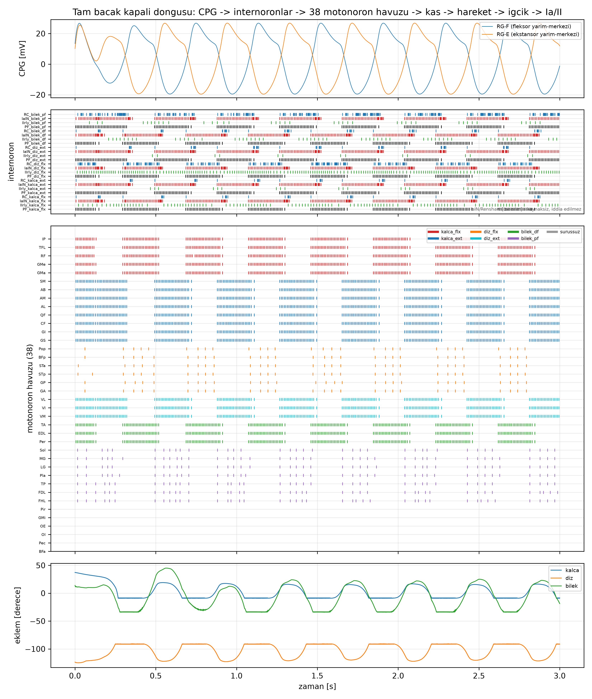
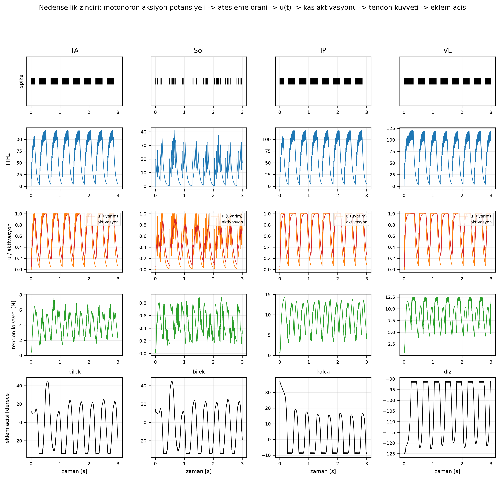
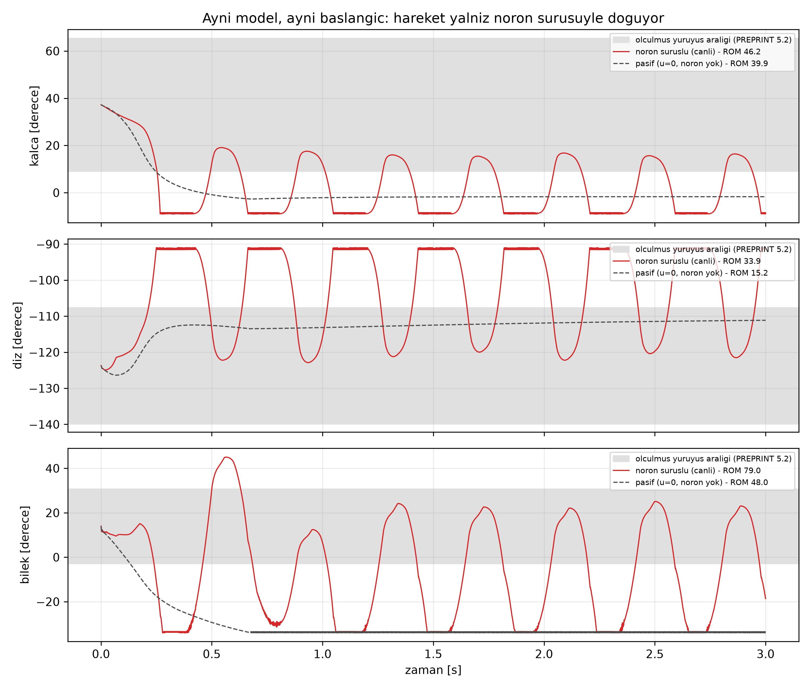
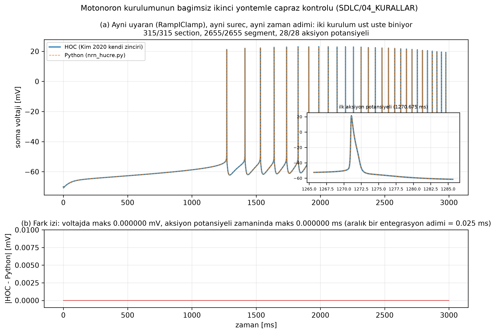
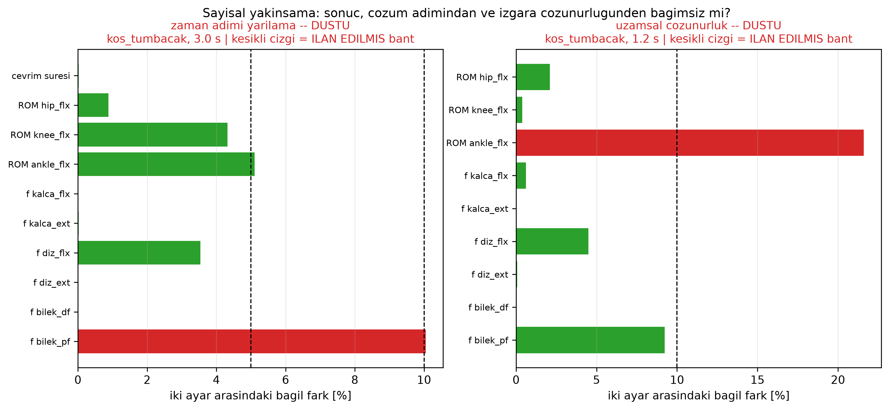
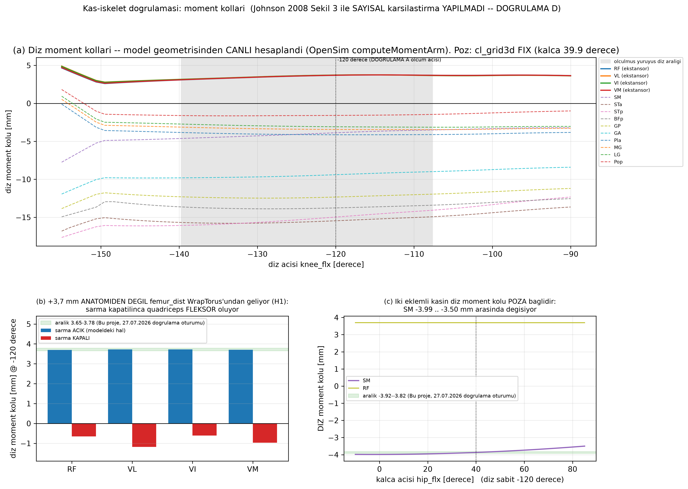
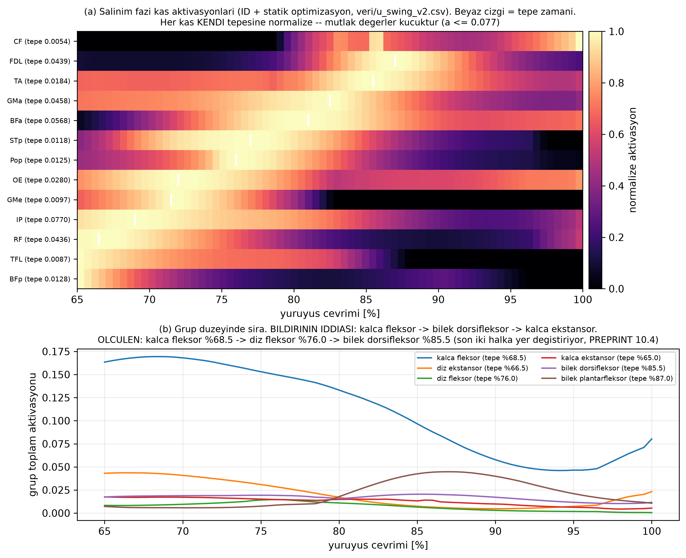

# Geçerlilik raporu — tam bacak kapalı döngüsü

**Tarih:** 09.09.2026 · **Koşu:** `kos_tumbacak.py 3.0` (3 DOF, 38 motonöron havuzu, referans
çözünürlük `d_lambda` = 0,1) · **Artefakt:** `veri/kopru/kosu_tumbacak.npz`

Bu rapor, projenin bugüne kadar **ölçülmüş** sonuçlarını figürlerle bir araya getirir ve her
ölçütün önceden ilan edilmiş aralığa göre geçip geçmediğini yazar. Bilimsel iddiaların kendisi
`PREPRINT.md`'dedir; ölçümlerin kanıt tabanı `DOGRULAMA.md`'dir. Bu rapor ikisinin yerine
geçmez, ikisine atıf yapar.

**Raporun iki ayrı sorusu vardır ve karıştırılmaz:**
1. *Kapalı döngü çalışıyor mu?* — mimari, nedensellik, ritim. **Cevap: evet, gösterildi.**
2. *Model fizyolojik lokomosyon üretiyor mu?* — eklem açıklıkları, ateşleme frekansları.
   **Cevap: henüz hayır; hangi ölçütün nerede kaldığı bölüm 6'da.**

---

## 1 · Ne kuruldu

Sprague-Dawley sıçanının arka bacağında omurilikten kasa uzanan kapalı döngü, iki simülatör tek
Python denetim döngüsünde **aynı zaman adımıyla** ilerletilerek kuruldu (`dt_k` = 0,15 ms;
NEURON kendi içinde 6 × 0,025 ms adım atar):

```
supraspinal tonik girdi -> CPG yarim-merkezleri (Morris-Lecar, RG-F / RG-E)
   -> 6 oruntu olusturma (PF) grubu: kalca/diz/bilek x fleksor/ekstansor
   -> 38 motonoron havuzu (Kim 2020 hucresi, 2655 segment, Cav1.3 PIC @ D_path=600 um)
   -> u(t) -> OpenSim ileri dinamigi (hip_flx + knee_flx + ankle_flx)
   -> hareket -> kas igcigi -> Ia / II -> iletim gecikmesi -> Ia sinapsi -> geri
```

Eklem açıları **reçete değildir**; kas kuvvetlerinden doğar. Grup başına birer IaIN, Renshaw ve
II aktarım internöronu vardır. Ayrıntı: `PREPRINT.md` bölüm 4, 6, 8.

---

## 2 · Kapalı döngü kanıtı

### 2.1 · Devrenin tamamı tek zaman ekseninde



CPG yarım-merkezleri zıt fazlı salınıyor; internöronlar ve 38 havuz bu ritme kilitlenmiş
patlamalar üretiyor; üç eklem de ritmik hareket ediyor. **Sürüşsüz altı havuz (Pir, GMi, OE, OI,
Pec, BFa) sessiz** — bunlar moment kolu işareti kararsız olduğu için PF sürüşü almaz
(`DOGRULAMA` S.4); rasterdeki sessizlikleri tasarımın doğrulanmasıdır, kusur değil.

**Ölçülen çevrim süresi 0,386 s**, ölçülmüş yürüyüş çevrimi 0,387 s, aralık [0,348–0,426] →
**ARALIKTA**. Bu, tam bacakta ilk kez elde edildi: 1,2 s'lik önceki koşuda çevrim süresi
ölçülemiyordu (`DOGRULAMA` R.7).

### 2.2 · Nedensellik zinciri



Dört kasta (TA, Sol, IP, VL — üç eklemi temsil eder) zincirin her halkası aynı zaman ekseninde:
motonöron aksiyon potansiyeli → ateşleme oranı → `u(t)` → kas aktivasyonu (Thelen dinamiği) →
tendon kuvveti → eklem açısı. Aradaki hiçbir halka reçete değildir.

### 2.3 · Hareketi nöronlar üretiyor: pasif kontrol



Aynı model, aynı başlangıç pozu, `u` = 0 (NEURON hiç kurulmadan). Pasif koşuda üç eklem de
sönümlenip duruyor; nöron sürüşlü koşuda ritmik salınım var. Bu, "hareket sinir komutundan
doğuyor" cümlesinin **doğrudan kontrol kolu**dur.

Aynı figür bir **sınırı** da gösteriyor: pasif koşu da bileği −34°'ye dayıyor. Bileğin alt sınıra
oturması **mekaniktir** (yer teması olmayan serbest salınan uzuv), devre kusuru değil
(`DOGRULAMA` R.7).

---

## 3 · Sayısal geçerlilik

### 3.1 · Motonöron kurulumu: HOC ile birebir



38 havuz, Kim'in HOC dosyalarındaki biyofiziğin Python'da yeniden uygulanmasıyla kuruluyor
(`nrn_hucre.py`). Yeniden uygulama sessiz sapma riski taşır; bu yüzden iki kurulum aynı süreçte,
aynı uyaranla koşturulup karşılaştırıldı: **315/315 section, 2655/2655 segment, 28/28 aksiyon
potansiyeli, aksiyon potansiyeli zaman farkı 0,000000 ms, soma voltaj farkı 0,000000 mV.**

### 3.2 · Yakınsama testleri



Kuplaj dışsaldır (ortak Jacobian kurulamaz), bu yüzden sonucun çözüm adımından bağımsız olduğu
gösterilmek zorundadır (`PREPRINT` 8).

- **Zaman adımı yarılama:** ayak bileği hattında geçti (`DOGRULAMA` P.8: çevrim %0,99, ROM %0,57,
  ateşleme %1,51–2,36; bantlar %5 / %10 / %10). Tam bacak sürümü (**Q.8**) bu oturumda koşuldu;
  sonucu aşağıdaki tabloda.
- **Uzamsal çözünürlük (yeni, bu oturumda kuruldu):** `d_lambda` 0,1 → 1,0 (5,47 kat az segment)
  denendi ve **düştü** — `ankle_flx` ROM'u %21,60 değişti (bant %10). Karar: bant
  genişletilmedi, **üretim Kim'in `d_lambda` = 0,1 değerinde kaldı.** Tek hücre düzeyinde aynı
  değişiklik geçiyordu (reobaz %3,5, f-I %0, PIC histerez kategorisi aynı); kusur köprü
  düzeyinde ortaya çıkıyor. Ayrıntı: `DOGRULAMA` bölüm T.

---

## 4 · Kas-iskelet doğrulaması

### 4.1 · Moment kolları



Bu figür, modeli açıp `computeMomentArm`'ı **canlı çağırarak** üretildi. Bildirinin iki cümlesi
doğrulanıyor: *"ekstansör kasların diz moment kolları pozitif, fleksörlerin negatiftir"* ve
*"quadriceps'te yaklaşık +3,7 mm"*. Ölçülen (diz −120°, `cl_grid3d` FIX pozu):
RF **+3,697** · VL **+3,727** · VI **+3,723** · VM **+3,703** · SM **−3,88** mm. Bu değerler
27.07.2026 doğrulama oturumunun (`DOGRULAMA` A) sayılarını bağımsız olarak yeniden üretiyor
(fark ≤ 0,02 mm; LG ve Pop'ta 0,07–0,15 mm, ikisi de poza duyarlı kaslar).

**Figürün kendisi iki dürüstlük notu taşıyor:**
- **Panel (b):** +3,7 mm'yi anatomi değil `femur_dist` **WrapTorus** üretiyor. Sarma
  kapatılınca quadriceps modelde **fleksör** oluyor: RF −0,65 · VL −1,18 · VI −0,61 · VM −0,97 mm.
  Bu, `DOGRULAMA` H1'in tablosunun birebir yeniden üretimidir.
- **Panel (c):** iki eklemli kasın diz moment kolu **poza bağlıdır.** SM'nin diz kolu kalça
  açısıyla −3,98 → −3,50 mm arasında değişiyor. Kayıtlı −3,87 mm bu aralığın içindedir ama
  **tek başına bir sayı değil, pozuyla birlikte bir sayıdır.**

Johnson 2008 Şekil 3 ile **sayısal karşılaştırma hâlâ yapılmadı** (`DOGRULAMA` D); bu yüzden
"deneysel ölçümlerle uyumludur" cümlesi bu raporda **kullanılmamaktadır.**

### 4.2 · Salınım fazı etkinlik sırası



Ters dinamik + statik optimizasyon çıktısından (`veri/u_swing_v2.csv`) bağımsız olarak yeniden
hesaplandı ve `PREPRINT` 9.2'nin tablosunu **birebir** verdi (grup toplam aktivasyonları
7,851 / 1,431 / 0,502 / 0,883 / 1,197 / 1,444).

| | bildirinin iddiası | ölçülen |
|---|---|---|
| 1. halka | salınım başında kalça fleksörleri | kalça fleksör tepe **%68,5** — doğrulandı |
| 2. halka | ortasında ayak bileği dorsifleksörleri | diz fleksör **%76,0** |
| 3. halka | sonunda kalça ekstansörleri | bilek dorsifleksör **%85,5** |

Son iki halka **yer değiştiriyor**: dorsifleksör fazın ortasında değil son üçte birinde tepe
yapıyor; kalça ekstansörleri salınım boyunca zaten çok zayıf (toplam 0,883). Tartışma ve
sınırları: `PREPRINT` 10.4.

---

## 5 · OpenSim GUI'de oynatma

`veri/goruntuleme/kopru_tumbacak.mot` — 607 satır, 53 sütun (14 koordinat + 38 kas aktivasyonu),
3,000 s. OpenSim GUI bu tek dosyayla hem hareketi oynatır hem kasları aktivasyona göre boyar.
Dosya OpenSim'in kendi `Storage` okuyucusuyla doğrulandı. Kilitli 13 koordinat, koşuda gerçekten
tutuldukları `cl_grid3d` FIX değerleriyle doldurulmuştur — uydurma bir poz değildir.

---

## 6 · Aralık tablosu

Bütün aralıklar ölçümden **önce** ilan edilmiştir (`SDLC/04_KURALLAR`); hiçbiri sonradan
genişletilmemiştir.

| ölçüt | ölçülen | aralık / ölçüt | kaynak | sonuç |
|---|---|---|---|---|
| Çevrim süresi | **0,386 s** | 0,387 · [0,348–0,426] | `ic.kopru_cevrim_suresi` | **GEÇTİ** |
| TA havuzu ateşleme | **82,71 Hz** | 97 · [80–110] | `gorassini2000.mn_frekans_TA_swing` | **GEÇTİ** |
| Soleus havuzu ateşleme | 16,95 Hz | 28 · [20–35] | `gorassini2000.mn_frekans_SOL_yuruyus` | kaldı (düşük) |
| MG / LG havuzu ateşleme | 17,52 / 17,41 Hz | 67 · [50–90] | `gorassini2000.mn_frekans_MGLG_ortagec` | kaldı (düşük) |
| Kalça ROM örtüşmesi | 0,10 | ≥ 0,5 | `ic.kopru_kalca_araligi` | kaldı |
| Diz ROM örtüşmesi | 0,30 | ≥ 0,5 | `ic.kopru_diz_araligi` | kaldı |
| Bilek ROM örtüşmesi | 0,43 | ≥ 0,5 | `ic.kopru_bilek_araligi` | kaldı |
| Antagonist zıtfaz (kalça/diz/bilek) | −0,548 / −0,775 / −0,787 | zıtfaz beklenir | ritim ölçütü (`DOGRULAMA` R) | **GEÇTİ** |
| Sessiz kas sayısı (sürülen 32 havuz) | **0** | 0 beklenir | ritim ölçütü (`DOGRULAMA` R) | **GEÇTİ** |
| Quadriceps diz moment kolu | +3,697…+3,727 mm | [3,65–3,78] | `ic.quad_diz_moment_kolu` | **GEÇTİ** |
| Semimembranosus diz moment kolu | −3,88 mm | [−3,92…−3,82] | `ic.sm_diz_moment_kolu` | **GEÇTİ** |
| Motonöron HOC çapraz kontrolü | 0,000000 ms / 0,000000 mV | < 0,025 ms | `ic_olcum` regresyon | **GEÇTİ** |
| Zaman adımı yarılama (ayak bileği) | %0,57–2,36 | %5 / %10 | `ic_olcum` yakınsama | **GEÇTİ** (P.8) |
| Zaman adımı yarılama (tam bacak, Q.8) | koşu sürüyor | %5 / %10 | `ic_olcum` yakınsama | *bekliyor* |
| Uzamsal yakınsama (`d_lambda` 0,1→1,0) | ROM bilek %21,60 | %10 | `ic_olcum` yakınsama | **DÜŞTÜ** |

Koşu maliyeti: 3,0 s simülasyon → 823,6 s CPU. Sınır kırpma olayı 3105 (pasif koşuda 998).

---

## 7 · Bugün ne iddia edilemez

- **Fizyolojik lokomosyon üretilmiyor.** Üç eklemin ROM örtüşmesi de ölçütün altında ve eklemler
  zamanın %32–52'sini kırpma sınırının 6° yakınında geçiriyor. Devre ritmi doğru periyotta
  üretiyor ama uzuv fizyolojik açıklıkta hareket etmiyor.
- **Plantar fleksör ve diz fleksör grupları hedefin 3-4 katı altında ateşliyor.** Bunlar denge
  ölçeği en küçük olan iki gruptur (`diz_flx` 0,283 · `bilek_pf` 0,372); kalibrasyon ekseni
  burasıdır (`DOGRULAMA` R.10).
- **Yer teması yok.** Salınım fazı kapsamı bildirinin kendi sınırıdır; basma fazı ve yer tepki
  kuvveti modellenmemiştir.
- **`IaIN` ve `Renshaw` kaynaksızdır** (`PREPRINT` 6.1) ve `II` katsayıları `[varsayım]`dır.
  Devrededirler ama hiçbir sonuç bunlara dayandırılarak iddia edilmemektedir.
- **Quadriceps moment kolu anatomik bir bulgu değildir** (bölüm 4.1, panel b) ve Johnson Şekil 3
  karşılaştırması yapılmamıştır.
- **Motonöron hücresi kedi kaynaklıdır** (Kim 2020); sıçanda PIC-konum etkisi zayıf çıkabilir.
- **Uzamsal çözünürlük kabalaştırılamaz** (bölüm 3.2): sonuç `d_lambda`'ya bağımlı çıktı.

---

## 8 · Yeniden üretim

```bash
P=$HOME/.venvs/usk26-kopru/bin/python

$P -u kod/kopru/kos_tumbacak.py 3.0        # kanonik kosu + pasif kontrol -> kosu_tumbacak.npz
$P    kod/kopru/capraz_kontrol.py          # HOC <-> Python -> capraz_kontrol.npz
$P -u kod/kopru/adim_yarilama.py 3.0 --tumbacak    # zaman adimi yarilama (Q.8)
$P -u kod/kopru/uzamsal_yakinsama.py 1.2 --tumbacak --dl 1.0   # uzamsal yakinsama

$P kod/kopru/figur_tumbacak.py             # raster, nedensellik, pasif
$P kod/kopru/figur_dogrulama.py            # momentkolu, salinim, yakinsama, capraz
$P kod/kopru/gui_disaver.py --tumbacak     # OpenSim GUI .mot
```

Her figürün yanında onu üreten sayısal veri `sekiller/<ad>.csv` olarak durur; yakınsama ve
çapraz kontrol figürleri testlerin kendi yazdığı artefaktları okur, sayı elle taşınmaz.

---

## 9 · `PREPRINT.md` için öneri (kullanıcı alanı — bu rapor dosyaya dokunmadı)

`CLAUDE.md` kuralı gereği `PREPRINT.md`'yi kullanıcı elle düzeltir. Bu koşudan sonra
güncellenmesi gereken üç yer:

1. **Bölüm 13, adım 7** ("Kapalı döngü koşusu — kısmen"): tam bacakta kanonik 3 s koşu
   **tamamlandı** ve çevrim süresi aralığa düştü (0,386 s). Durum "kısmen"den çıkarılabilir;
   ROM ölçütleri hâlâ geçmediği için "bitti" de değildir.
2. **Bölüm 6.4 karar tablosu**, iki eklemli kaslar için hâlâ "tek havuz, iki örüntü oluşturma
   katmanından girdi" diyor. Bu karar 07.09.2026'da geri alındı (`DOGRULAMA` R.5): üyelik artık
   EMG fazına göre ve her kas **tek** gruba üye. Aynı tablodaki EDL kaydı da model ölçümüyle
   desteklenmiyor (diz kolu −0,63 mm).
3. **Bölüm 9.1**, semimembranosus için tek bir sayı veriyor (−3,87 mm). Bugünkü ölçüm bu sayının
   **poza bağlı** olduğunu gösteriyor (−3,98…−3,50 mm, kalça açısına göre); sayının yanına ölçüm
   pozu yazılmalı.
