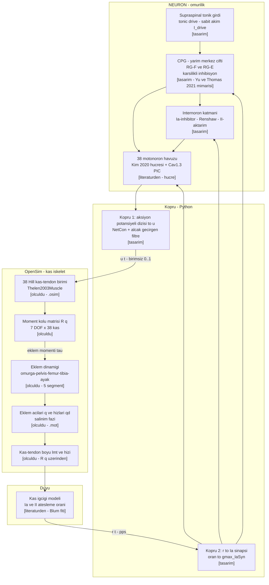

# D1 — Sistem: nöromekanik kapalı döngü

Projenin tamamı tek şekilde: omurilik devresi (NEURON) kası sürer, kas-iskelet sistemi (OpenSim)
hareket üretir, hareket duyusal geri besleme doğurur, geri besleme omuriliğe döner.



## Aynı şekil, Mermaid çizmeyen editörler için

```
   NEURON  (omurilik)                                 OpenSim  (kas-iskelet)
 ┌──────────────────────────┐                    ┌──────────────────────────────┐
 │ supraspinal tonik girdi  │                    │  38 Hill kas-tendon birimi   │
 │            │             │                    │            │                 │
 │            ▼             │      u(t)          │            ▼                 │
 │   CPG  (RG-F ⇄ RG-E)     │  ───────────────►  │  moment kolu R(q) · 7 DOF    │
 │            │             │   birimsiz 0..1    │            │                 │
 │            ▼             │                    │            ▼                 │
 │   internöron katmanı     │                    │  eklem dinamiği (5 segment)  │
 │   (Ia-inh · Renshaw · II)│                    │            │                 │
 │            │             │                    │            ▼                 │
 │            ▼             │                    │  q(t), q̇(t)  →  l_mt , v_mt  │
 │  38 motonöron havuzu     │                    │            │                 │
 │  (Cav1.3 PIC)            │                    │            ▼                 │
 │            ▲             │      r(t)          │      kas iğciği (Ia, II)     │
 │            └─────────────┼──◄─────────────────┼────────────┘                 │
 └──────────────────────────┘   pps + gecikme    └──────────────────────────────┘
```

## Döngüde taşınan değişkenler

| Sembol | Ne | Birim | Yön | Durum |
|---|---|---|---|---|
| `u(t)` | kas aktivasyon komutu, kas başına bir sayı | birimsiz, 0–1 | NEURON → OpenSim | köprü `[tasarım]`; bugün `veri/u_swing_v2.csv` statik optimizasyondan üretiliyor `[ölçüldü]` |
| `r(t)` | Ia ve II afferent ateşleme oranı, kas başına | pps (≈ Hz) | OpenSim → NEURON | model `[literatürden]`, köprü `[tasarım]` |
| `q`, `q̇` | eklem açıları ve hızları, 7 bacak DOF | rad, rad/s | OpenSim içi | `[ölçüldü]` — `veri/rat_walk_bone_smooth.mot` |
| `τ` | eklem momenti | N·mm | OpenSim içi | `[ölçüldü]` — ters dinamik çıktısı |
| `l_mt`, `v_mt` | kas-tendon boyu ve hızı | mm, mm/s | OpenSim → iğcik | `[ölçüldü]` — kas yolu geometrisinden |
| `F` | kas kuvveti | N | OpenSim içi | `[ölçüldü]` — Hill modeli |

## Zaman ve gecikmeler

| Büyüklük | Değer | Kaynak | Durum |
|---|---|---|---|
| NEURON entegrasyon adımı | 0,025 ms | `oz_kim2020_piclokasyonu.md` §3d; `oz_fietkiewicz2025_neuronmujoco.md` §3d | `[literatürden]` |
| İki simülatörün aynı zaman adımıyla eşzamanlı ilerletilmesi | aynı `dt` ile tek döngü | `oz_fietkiewicz2025_neuronmujoco.md` §3b | `[literatürden]` — yöntem |
| Ia afferent iletim gecikmesi (sıçan) | 1,5 ± 0,2 ms | `oz_vincent2017_proprioseptor.md` Tablo 4 | `[literatürden]` |
| II afferent iletim gecikmesi (sıçan) | 1,8 ± 0,4 ms | `oz_vincent2017_proprioseptor.md` Tablo 4 | `[literatürden]` |
| Efferent (motonöron → kas) gecikmesi | seçilecek | Kim kedide toplam 10 ms kullanıyor; sıçanda kısalmalı | `[varsayım]` |
| Kas-iskelet örnekleme | salınım fazı 71 örnek, gait %65–100 | `veri/u_swing_v2.csv` | `[ölçüldü]` |

## Sınırlar ve okuma uyarıları

- **Kas dinamiği nerede yaşıyor:** Hill tipi kas-tendon dinamiği **OpenSim tarafındadır**
  (`Thelen2003Muscle`). Kim'in NEURON modeli kendi içinde bir `muscle_unit` bölmesi taşır
  (`CaSP` + `fHill` mekanizmaları); o bölme yalnız **Aşama 1 doğrulamasında** (Kim'in
  yayımlanmış şekillerinin yeniden üretiminde) kullanılır, kapalı döngüde devre dışıdır.
  Aksi halde kuvvet iki kez üretilmiş olur.
- **Ib (Golgi tendon organı) döngüde yok** — bilinçli basitleştirme; bedeli
  `oz_vincent2017_proprioseptor.md` §6'da yazılı (sıçanda Ib pasif germede susmuyor).
- **γ-motonöron (fusimotor) yok** — iğcik kazancı pasif kabul ediliyor; Vincent'ın aralıkları da
  pasif koşulda ölçülmüştür, bu yüzden doğrulama tutarlıdır, ama lokomosyona genellenemez.
- Geri beslemenin CPG'ye ve internöronlara giden okları `[tasarım]`; hangi kolun kullanılacağı
  (yalnız monosinaptik Ia mı, yoksa CPG'ye de mi) `gFB / gCPG` dengesiyle taranacaktır
  (`oz_yu2021_kapalidongu.md` §5).
