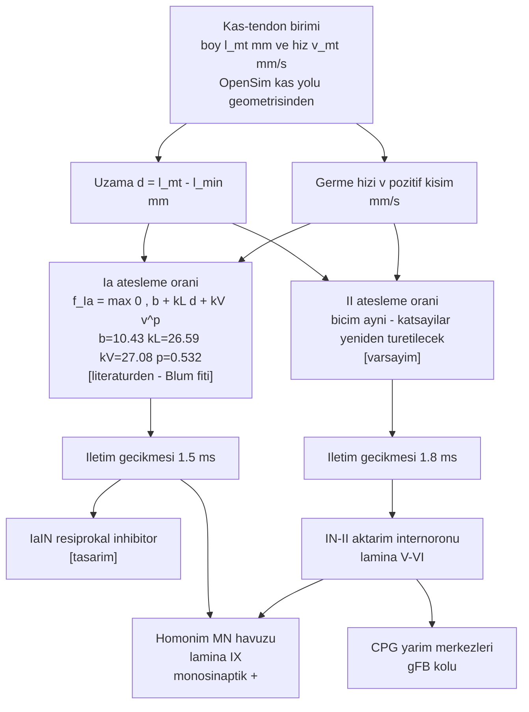

# D4 — Kas iğciği ve Ia / II afferent yolu

Döngünün duyusal yarısı: kas-tendon biriminin boyu ve hızı, afferent ateşme oranına; oran da
omurilikteki hedeflere.



## Model denklemi ve kaynağı

`veri/r_katsayilari_v3.json`, kayıt `Ia_kinematik_v3`:

```
f_Ia = max( 0 , 10,43 + 26,59 · d[mm] + 27,08 · max(v,0)[mm/s]^0,532 )
```

Kaynak: Blum 2020 ham eğrileri, 7 Ia afferenti, medyan fit. `[literatürden]`

**II için durum:** aynı JSON'un `II_v2` kaydı açıkça şunu yazıyor: *"II bu pakette YOK (20 Ia);
II katsayıları Vincent v2 fitinde kaldı."* Yani II denkleminin katsayıları **doğrulanmamıştır**.
Repodaki eski kapalı-döngü betiğinde bir II ifadesi bulunuyor ama kaynağı izlenemiyor; bu yüzden
`[varsayım]` sayılır ve Vincent 2017 bantlarına yeniden fit edilecektir.

**Kalibrasyon uyarısı (aynı JSON, `surekli_hareket_sonumu`):** sürekli hareket denemesinde ölçüm
ortalaması ~15 Hz iken statik tahmin ~90 Hz çıkıyor (≈6 kat aşırı). Yani bu fit, **rampa-tut**
protokolüne uygundur; lokomotor kullanımı aşağı kalibrasyon gerektirir. Kapalı döngüde `r(t)`
ölçeklenirken bu not dikkate alınacaktır.

## Sıçan doğrulama bantları (Vincent 2017)

Test koşulu: pasif triceps surae, 3 mm rampa-tut (MTL'nin %7'si), 20 mm/s, diz 120°.
Bantlar ±1 SD; kaynak `oz_vincent2017_proprioseptor.md` Tablo 4 ve §7.

| Büyüklük | Değer | Bant | Not |
|---|---|---|---|
| Ia dinamik tepe frekansı `Dyn(pfr)` | 176,4 pps | [123, 230] | n = 144 |
| Ia dinamik indeksi `DI` | 137,9 pps | [90, 186] | `DI = Dyn(pfr) − Stat(mfr)` |
| II dinamik tepe frekansı | 105,4 pps | [57, 154] | n = 62 |
| Ia eşik boyu `ThrL` | 0,2 mm | [0, 0,4] | Lr = 90° bilek açısındaki dinlenme boyu |
| II eşik boyu | 0,6 mm | [0, 1,2] | — |
| Ia yavaş rampa (4 mm/s) tepe | 124,4 pps | [70, 179] | — |
| Ia / II iletim gecikmesi | 1,5 / 1,8 ms | — | Tablo 4 |

`Stat(mfr)` **test olarak alınmaz**: SD ortalamayı aşıyor (30,1 ± 48,4) ve gruplar ayrışmıyor.

## Omurilikteki hedefler (anatomik dayanak)

`oz_vincent2017_proprioseptor.md` §4b:

- İğcik afferentlerinin varikozitelerinin **%80'den fazlası** lamina V/VI + lamina IX'ta.
- **Ia**, lamina IX'a yanlı; motor çekirdekte ≥30 µm gövdelerle temas ediyor → Ia → α-motonöron
  monosinaptik bağlantısının anatomik karşılığı.
- **II**, lamina V/VI'ya yanlı → doğrudan değil, aktarım internöronu üzerinden.
- **Ib** lamina IX'a hiç girmiyor; modelimizde Ib yok, bedeli §6'da yazılı.

## Bu diyagramda tasarım olan

- `d` referansının (`l_min`) hangi poz olduğu: model gridindeki minimum kas boyu kullanılıyor;
  Vincent'ın `Lr` tanımıyla (90° bilek açısındaki dinlenme boyu) eşleştirilmesi **yapılmadı**
  (`oz_vincent2017_proprioseptor.md` §9). Doğrulama koşusunda açıkça tanımlanacak.
- Ia → CPG kolu: `oz_yu2021_kapalidongu.md`'deki `gFB` yerine burada II üzerinden çizildi; hangi
  afferentin CPG'ye bağlanacağı taranacak bir tasarım kararıdır.
- γ-motonöron (fusimotor) girdisi yok; iğcik pasif.
