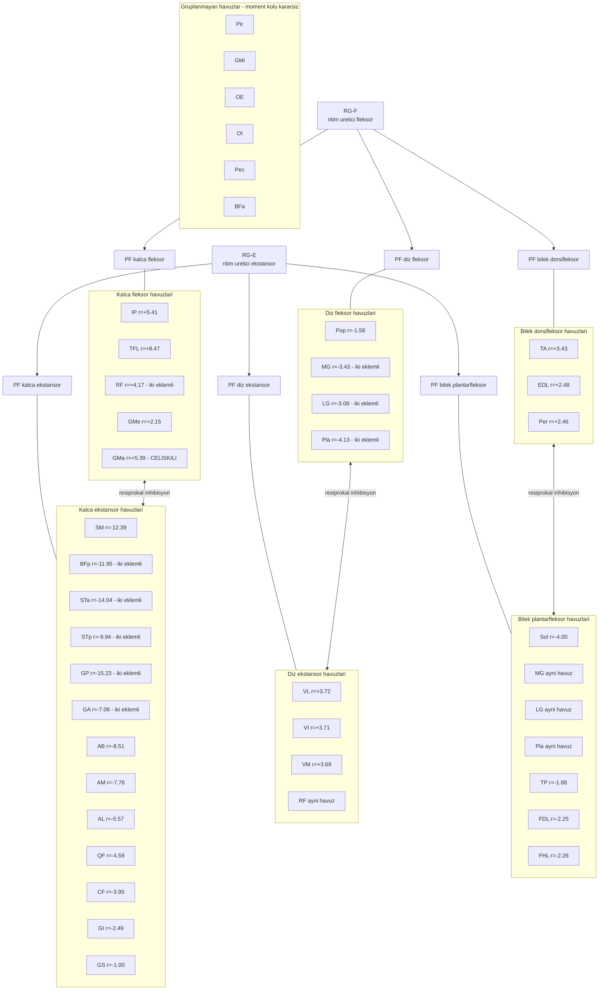

# D6 — 38 motonöron havuzu ile 38 kasın eşleşmesi

**Kural:** OpenSim modelindeki her kasın **bir motonöron havuzu** vardır (38 kas → 38 havuz).
Havuzlar CPG'ye doğrudan değil, eklem başına bir **örüntü oluşturma katmanı**
(pattern formation, PF) üzerinden bağlanır.

## Neden eklem başına bir örüntü oluşturma katmanı var

Tek bir yarım-merkez çifti (RG) yalnız iki faz üretir: fleksör ve ekstansör. Ama bu çalışmanın
salınım fazı ölçümü (`D7`) üç eklemin **farklı zamanlarda** tepe yaptığını gösteriyor: kalça
fleksörleri %68,5, diz fleksörleri %76,0, ayak bileği dorsifleksörü %85,5. Tek fazlı bir
girdi bu gecikmeleri veremez. Bu yüzden RG ile motonöron havuzları arasına eklem başına bir
örüntü oluşturma katmanı (PF) konur. `[tasarım]` — literatür özetlerinde doğrudan kaynağı yoktur;
gerekçesi kendi ölçümümüzdür.

## Havuz iç yapısı

| Karar | Seçim | Durum |
|---|---|---|
| Havuz sayısı | 38 (kas başına bir) | `[tasarım]` — kullanıcı kararı |
| Havuzdaki motonöron sayısı `N` | ilk sürümde 1 (temsilî motonöron), sonra artırılacak | `[tasarım]` |
| Motonöron modeli | Kim 2020 hücresi (`D3`) | `[literatürden]` |
| Devreye alma (recruitment) | `F_max` sırasına göre Henneman büyüklük ilkesi (size principle) | `[tasarım]` |
| İki eklemli (biartiküler) kaslar | **tek havuz**, iki örüntü oluşturma katmanından da girdi alır (RF, BFp, STa, STp, GP, GA, MG, LG, Pla, EDL) | `[tasarım]` |
| Antagonist eşleşme | eklem başına fleksör ⇄ ekstansör grupları | moment kolu işaretinden `[ölçüldü]` |
| Gruplanmayanlar | Pir, GMi, OE, OI, Pec, BFa — moment kolu işareti ızgarada kararsız | `[ölçüldü]` gerekçe |

## Ateşleme hedefleri (havuz çıkışının doğrulanacağı aralıklar)

Kaynak: `oz_gorassini2000_motorunite.md` §7 — bilinçli, serbest yürüyen sıçanda tek motor ünite
kayıtları. Bunlar havuz **çıkışının** doğrulama hedefleridir; parametre değil.

| Kimlik | Değer | Aralık | Not |
|---|---|---|---|
| `mn_frekans_TA_swing` | 97 Hz | [80, 110] | salınım fazı dorsifleksör |
| `mn_frekans_MGLG_ortagec` | 62–72 Hz | [50, 90] | basma fazı; bizim kapsam dışı ama havuz sınırı |
| `mn_frekans_SOL_yuruyus` | 28 Hz | [20, 35] | yavaş ünite |
| `dublet_orani_hizli_uniteler` | ≥ %80 adım | [%50, %100] | başlangıç dubleti, ISI ≤ 10 ms |
| `dublet_orani_yavas_SOL` | ~%18 adım | [%0, %30] | gevşetilmiş dublet tanımıyla |

**Uyarı** (`oz_gorassini2000_motorunite.md` §6): MG/LG'de tek ünite aktivitesi gros-EMG zarfından
kopuktur (r² = 0,0015–0,010). Havuzu tek ortak sürücüyle modellemek soleus için savunulabilir,
MG/LG için sorgulanır. Ayrıca yavaş ünitelerde dublet yoktur; PIC'i tüm havuzlara aynı güçle
koyarsak yavaş motonöronlarda fazla dublet üretiriz.
