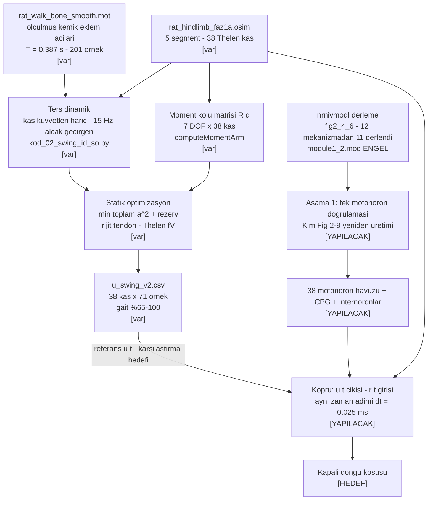
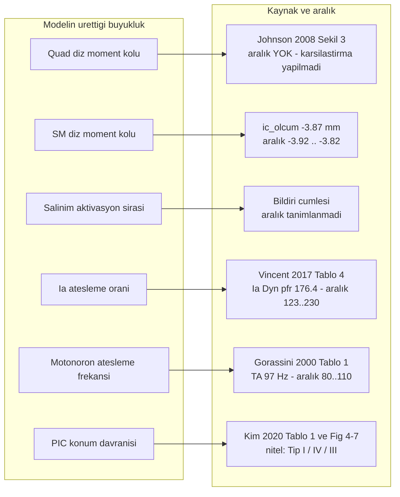

# D8 — İşlem hattı ve doğrulama haritası

## İşlem hattı

## Doğrulama haritası

Her ok bir iddiayı bir kaynağa bağlar. `literatur` kayıtları dış yayına, `ic_olcum` kayıtları
kendi ölçümümüze aittir; ikisi karıştırılmaz (`../README.md`).

## Aralık durumu

| Kimlik | Değer | Aralık | Tür | Durum |
|---|---|---|---|---|
| `ic.quad_diz_moment_kolu` | 3,70 · 3,73 · 3,72 · 3,70 mm | [3,65 · 3,78] | `ic_olcum` | JSON'da **var** — regresyon aralığı |
| `ic.sm_diz_moment_kolu` | −3,87 mm | [−3,92 · −3,82] | `ic_olcum` | JSON'da **var** — regresyon aralığı |
| `johnson2008.kas_sayisi` | 37 | — | `literatur` | JSON'da var |
| `johnson2008.lokomosyon_diz_araligi` | [−110 · −60]° | — | `literatur` | JSON'da var |
| `johnson2008.quad_diz_moment_kolu_egrisi` | — | — | `literatur` | **boş** — Şekil 3 karşılaştırması yapılmadı |
| `Ia_Dyn_pfr_hizli` | 176,4 pps | [123 · 230] | `literatur` | literatür özetinde hazır (`oz_vincent2017` §7), **JSON'a girmedi** |
| `Ia_DI_hizli` | 137,9 pps | [90 · 186] | `literatur` | aynı |
| `II_Dyn_pfr_hizli` | 105,4 pps | [57 · 154] | `literatur` | aynı |
| `Ia_ThrL` / `II_ThrL` | 0,2 / 0,6 mm | [0 · 0,4] / [0 · 1,2] | `literatur` | aynı |
| `mn_frekans_TA_swing` | 97 Hz | [80 · 110] | `literatur` | literatür özetinde hazır (`oz_gorassini2000` §7), **JSON'a girmedi** |
| `dublet_orani_hizli_uniteler` | ≥ %80 adım | [%50 · %100] | `literatur` | aynı |
| `MN_esik_boy_dususu` | ~4 kat | [2 · 6] | `literatur` | literatür özetinde hazır (`oz_kim2020` §7), **JSON'a girmedi** |
| `momentkolu_BFA_kalca_tamekstansiyon` | −15,3 mm | [−18 · −12] | `literatur` | literatür özetinde hazır (`oz_johnson2008` §7), **JSON'a girmedi** |

**Kural** (`SDLC/04_KURALLAR.md`): aralık testten **önce** gerekçesiyle ilan edilir; ölçüm banda
düşmezse önce model ve varsayımlar sorgulanır, aralık sessizce genişletilmez.

## Yöntem borçları (kaynağı belli, uygulanmadı)

| Yöntem | Kaynak | Ne için |
|---|---|---|
| Adım-yarılama yakınsama testi | `oz_fietkiewicz2023_neuronpointer.md` §5 | Köprü sayısal kararlılığı; iki simülatör dıştan kuplajlandığı için Jacobian kurulamıyor, bu test zorunlu |
| Eş adımlı ilerletme döngüsü (dt = 0,025 ms) | `oz_fietkiewicz2025_neuronmujoco.md` §3b | Köprü mimarisi |
| `gFB` / `gCPG` taraması + gürbüzlük ölçümü | `oz_yu2021_kapalidongu.md` §7 | Geri besleme ağırlığının seçimi ve ödünleşimin raporlanması |
| PIC konumu taraması `D_path` 100–1000 µm | `oz_kim2020_piclokasyonu.md` Tablo 1 | Motonöron girdi-çıktı tipinin belirlenmesi |
